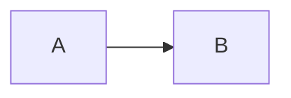
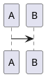

# Feishu to Hexo Blog

Turn one or more Feishu documents into source-faithful Hexo posts and carry the publication through to verified live URLs.

## Read before acting

1. Read [references/blog-contract.md](references/blog-contract.md) for the repository-specific paths, build commands, deployment workflow, and cleanup rules.
2. Read [references/default-cover-style.md](references/default-cover-style.md) when the user has not supplied a cover style or asks what the built-in style looks like.
3. Invoke and fully follow these companion skills when their stage begins:
   - `lark-doc` for Docx/Wiki reading and media discovery.
   - `lark-whiteboard` for whiteboard code or preview export.
   - `baoyu-cover-image` for raster cover generation.
   - `chrome:control-chrome` when it is available for deployed-page validation.
   - Otherwise use an equivalent Chrome browser-control capability built into the current Agent runtime, if one exists.

The companion skills own authentication, browser setup, image-generation confirmation, and their tool-specific safety rules. This skill coordinates them; it does not override them. Chrome control is optional: do not assume that Trae, Claude Code, Codex, or another Agent exposes the same browser skill or tool name.

## Inputs and defaults

Collect or infer:

- One or more Feishu Docx/Wiki URLs.
- An exact publication date for each post. Do not substitute the current date when the user supplied one.
- Optional title, slug, category, tags, cover style, and desired commit wording.
- Whether the user requested the full publish workflow or only a subset.

Use document titles for missing titles. Derive stable kebab-case slugs when missing and show any material inference in a progress update. For this repository, use the defaults in `blog-contract.md` unless the user explicitly overrides them.

Publishing changes external state. A request containing “发布”, “推送”, “部署”, “上线”, or an equivalent end-to-end instruction authorizes the normal commit/push/deploy workflow for the scoped blog changes. A conversion-only or preview-only request does not authorize a push.

## Workflow

### 1. Establish a safe baseline

- Confirm the repository root, current branch, remote, and live base URL.
- Inspect `git status --short` before editing. Treat existing changes as user-owned and preserve them.
- Create a uniquely named repo-local working directory such as `.lark-to-hexo-work/<slug>-<timestamp>/`. `lark-cli` file arguments must remain relative to its current working directory.
- Never use destructive Git commands to make the tree clean. Stage only files belonging to this task.

### 2. Read the Feishu source without truncation

- Use `lark-doc` with user identity and follow its authentication flow.
- For short documents, fetch Markdown plus enough structural detail to enumerate all content and media.
- For long documents, fetch an outline with block IDs first, then fetch each first-level section individually. This avoids treating truncated terminal output as the full article.
- Keep a source inventory containing title, heading order and depth, paragraphs, lists, tables, quotes, links, code blocks, images/files, and whiteboard tokens.
- If the document embeds Sheets or Base data, route to their corresponding skills rather than silently dropping the embedded content.

### 3. Convert content faithfully

- Create `source/_posts/<slug>.md` and `source/_posts/<slug>/`.
- Preserve the source’s wording, order, hierarchy, links, lists, tables, quotes, and code. Do not summarize or embellish unless the user explicitly asks for editorial rewriting.
- Use this Front Matter shape, omitting only genuinely unspecified optional arrays:

```yaml
---
title: <exact title>
date: <YYYY-MM-DD HH:mm:ss>
tags:
  - <tag>
categories:
  - [<category>]
featured_image: ./cover.jpg
---
```

- Copy/download every referenced article image into the post asset directory. Use Markdown paths such as `./image-01.png`; never depend on temporary Feishu URLs in the final post.
- Use descriptive alt text grounded in the image’s visible content when practical.

### 4. Preserve whiteboard semantics

For each `<whiteboard>` token:

1. Query it as code through `lark-whiteboard`.
2. If exactly one Mermaid or PlantUML diagram is recoverable, insert its source as a fenced Markdown block:

````markdown



````

3. Do not replace recoverable diagram source with a screenshot.
4. If code export is unavailable or the board is not code-backed, export a preview image, keep it as a local asset, and explicitly report the fallback.
5. Preserve code exactly except for syntax repairs required for runtime rendering. When Mermaid SVG is later serialized into an image source, normalize `<br>` and `<br />` to XML-valid `<br/>` before setting `image.src`.

### 5. Generate the cover

- If the user specifies a style, pass that choice to `baoyu-cover-image`.
- Otherwise recommend the built-in `terminal-editorial-light` preset from `default-cover-style.md`.
- Respect `baoyu-cover-image` confirmation rules. The built-in preset is a recommendation, not permission to skip confirmation. “按默认生成”, “直接生成”, `--quick`, or equivalent wording permits using it without another style question.
- Generate a raster cover, then copy the final image to `source/_posts/<slug>/cover.jpg` (or update Front Matter if another supported extension is intentionally used).
- Keep required prompt records only while generation is in progress. Remove cover prompts, rejected candidates, and backups before closeout unless the user explicitly asks to retain them.

### 6. Validate before publication

Compare the finished post against the source inventory. Confirm:

- Every source section is present once and in order.
- Publication date is exact.
- Every image reference resolves to a local file.
- Mermaid/PlantUML boards use the correct fence and are not syntax-highlighted as ordinary code.
- Cover path resolves and the cover visually matches the chosen style.

Run:

```bash
node .agents/skills/lark-to-hexo-blog/scripts/check-post.mjs <slug>
npm run check:images
npm run check:highlight
npm run build
```

Fix failures before publishing. Do not treat a local build alone as proof of successful deployment.

### 7. Remove process files

Before committing and again before the final response:

- Run `npm run clean` after any Hexo build.
- Remove only the exact task working directory and confirmed task-generated cover prompts, discarded images, downloads, conversion intermediates, scratch files, and logs.
- Verify that `public/`, `db.json`, the task working directory, and temporary QA posts are absent.
- Preserve final Markdown, referenced images, cover images, source code, manifests, configuration, and all pre-existing user changes.

### 8. Publish and wait for GitHub Pages

Only when publication is in scope:

1. Review `git diff --check`, `git diff`, and `git status --short`.
2. Stage only intentional task files. Do not accidentally absorb unrelated worktree changes.
3. Commit with a focused message and push the current publishing branch.
4. Record the exact commit SHA.
5. Locate the Pages workflow run for that SHA with `gh`, wait until it completes, and require a successful conclusion. A successful push is not a successful deployment.
6. If Actions fails, inspect the failed step, fix the scoped cause, push the correction, and wait for the new exact-SHA run.

### 9. Verify the live page when Chrome control is available

First inspect the current Agent's available skills and tools:

1. If `chrome:control-chrome` is available, invoke it and follow its instructions.
2. Otherwise, if the Agent provides a built-in capability that actually controls Chrome, use that capability according to its own instructions.
3. If neither exists, skip browser automation. Do not install a plugin, substitute a different browser, or fail an otherwise successful deployment solely because Chrome control is unavailable. Mark the article as **manual verification required**, return its exact live URL, and tell the user what remains to check.

When Chrome control is available, open each exact article URL, preferably with a harmless cache-busting query after a fresh deployment, and verify:

- The page loads successfully at the expected category/slug permalink.
- Title, date, headings, article text, links, cover, and inline images match the source post.
- H1 through H5 headings appear correctly in the article and right-side TOC when present.
- Mermaid and PlantUML render as diagrams, adapt to the current Hexo theme, and open in the shared image preview.
- Image preview shows `−`, scale, `+`, fit, and close controls; wheel zoom and drag-after-zoom work.
- Common fenced languages render with syntax highlighting.
- The browser console has no relevant rendering/runtime errors.

Do not claim Chrome verification based on local HTML or HTTP status alone. When the Chrome step is skipped, distinguish “deployment succeeded” from “visual verification pending” in the completion response.

## Completion response

Lead with the result. For each article return:

- Title and exact publication date.
- Live article URL.
- Commit SHA and GitHub Actions run URL when published.
- Verification result: either `Chrome verified` or `manual verification required (Chrome control unavailable)`.
- Any declared fallback, especially non-code whiteboards.

When manual verification is required, include a compact checklist covering page load, title/date/content, images, H1-H5 TOC, Mermaid/PlantUML, syntax highlighting, image zoom controls, and console errors. Also state that process files were removed and distinguish any preserved pre-existing worktree changes. If publication was not requested, return the local post path and say explicitly that no push or live verification occurred.

## Stop conditions

Pause and ask for the smallest missing decision only when it materially changes the result, such as an absent publication date the user requires, cover confirmation mandated by the cover skill, unresolved Feishu authorization, or unclear permission to publish. Authentication links must follow the companion skill’s split-flow instructions.
