> **一句话概括：**A2A（Agent2Agent）是 Google Cloud 于 2025 年推出的开放协议，用于解决**多个 AI Agent 之间如何互相发现、通信与协作**的问题。它与 MCP「一横一纵」互补——MCP 让 Agent 向下连工具，A2A 让 Agent 向外连 Agent。


**阅读导航：**本文以图表为主、文字为辅，依次讲解 A2A 的概念、与 MCP 的区别、协议原理与流程、Client 与 Server 两端实现，最后以一个真实开源项目为例做代码级实践剖析。

---

# 一、什么是 A2A 协议

A2A（Agent2Agent）协议是由 **Google Cloud** 推出的开放协议，旨在促进不同 AI Agent 之间的互操作性。其核心目标是：让由**不同供应商构建、使用不同技术框架**的 Agent，能够在动态的多 Agent 生态中有效通信与协作。

## 1.1 为什么需要 A2A：单 Agent 的天花板

一个 Agent 的本质是「一个 LLM + 一组工具 + 一段上下文窗口」，这三个维度都有各自的上限。当任务足够复杂时，单 Agent 就会力不从心：

| 瓶颈维度 | 问题描述 | A2A 的解法 |
|-|-|-|
| **工具数量** | 一个 Agent 装上百个工具，模型选择效率极低、易混乱 | 拆分为多个专业 Agent，各自聚焦少量工具 |
| **上下文窗口** | 128K token 看似很多，中间产物（搜索结果、草稿、反思）会迅速塞满，后段生成顾不上前文 | 子任务在独立 Agent 内闭环，上下文互不污染 |
| **专业能力** | 同一 Agent 既做代码审查又做市场分析，效果不如各自专精的 Agent | 为不同任务配置/微调专用 Agent，再汇总 |

> **典型场景：**「做一份 AI 编程工具竞品分析报告，含行业趋势、技术对比、商业模式与 SWOT」。单 Agent 做会被搜索结果撑满上下文；更优解是一个**调度 Agent** 拆分任务，交给**市场分析 Agent**、**技术研究 Agent** 并行处理，最后汇总——这正是 A2A 要支撑的多 Agent 协作。


## 1.2 A2A 的五大设计原则

| 设计原则 | 含义 |
|-|-|
| **拥抱 Agent 能力** | 允许 Agent 以自然、非结构化的方式协作，无需共享内存、工具或上下文，实现真正的多 Agent 场景 |
| **基于现有标准** | 建立在 HTTP、SSE、JSON-RPC 2.0 等广泛接受的标准之上，便于集成企业现有 IT 栈 |
| **默认安全** | 原生支持企业级身份验证与授权，确保只有授权用户/系统可访问 Agent |
| **支持长任务** | 从秒级快速任务到分钟/小时级深度研究都能覆盖，执行过程中可提供实时反馈、通知与状态更新 |
| **模态无关** | 支持文本、音频/视频流、表单、iframe 等多种交互形式，适应力强 |

## 1.3 A2A 的三个参与者

相比 MCP 的「客户端-主机-服务器」三方结构，A2A 只定义了三个参与者，缺少 Host 角色——这是设计取舍：A2A 选择规范**协作机制**，把安全、Agent 发现等交给外部实现。

| 参与者 | 职责 |
|-|-|
| **用户 User** | 使用 Agent 系统完成任务的人或服务，是需求的最终来源 |
| **客户端 Client** | 代表用户向远程 Agent 发起操作请求的实体（可以是一个应用、Agent 或调度器） |
| **服务端 Server** | 不透明（黑盒）的远程 Agent，即 A2A Server；对外只暴露能力，内部实现完全隐藏 |

三者的关系与协作载体如下图所示：

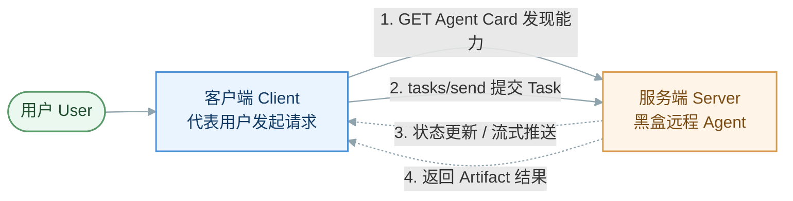

---

# 二、A2A 协议与 MCP 协议的区别

这是面试与实践中最常被问到的问题。最简单的理解方式是看**方向**：**MCP 是 Agent 向下连工具，A2A 是 Agent 向外连其他 Agent**。两者解决的是完全不同维度的问题，不存在谁替代谁。

## 2.1 一横一纵：直观示意

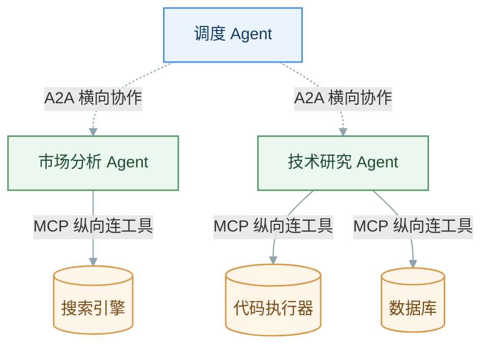

> **协作关系：**在一个 Agent 内部用 **MCP** 连各种工具（数据库、浏览器、代码执行器），用 Function Calling 触发调用；多个 Agent 之间用 **A2A** 互相通信、分工。复杂系统里两者**通常同时使用**。


## 2.2 逐项对比

| 特性 | A2A | MCP |
|-|-|-|
| **主要用途** | Agent 间通信与协作 | 为模型提供工具和上下文，连接外部资源 |
| **核心架构** | 客户端-服务器（Agent-Agent） | 客户端-主机-服务器（应用-LLM-外部资源） |
| **标准接口** | Agent Card、Task、Message、Artifact | Resource、Tool、Memory、Prompt |
| **通信协议** | HTTP + JSON-RPC 2.0 + SSE | JSON-RPC 2.0（stdio / HTTP+SSE） |
| **关键特性** | 多模态、动态协作、能力发现、任务管理、安全 | 模块化、安全边界、可复用连接器、SDK、工具发现 |
| **性能重点** | 异步通信、处理长任务负载 | 高效上下文管理、并行处理、缓存提升吞吐 |
| **连接方向** | 横向：Agent ↔ Agent | 纵向：Agent ↓ 工具/资源 |

# 三、A2A 协议原理与流程

A2A 建立在 **JSON-RPC 2.0** 之上，定义了一套围绕 **Task（任务）** 展开的通信机制。本节先拆解核心概念，再看状态机与完整交互流程。

## 3.1 核心概念全景

| 概念 | 说明 | 载体形式 |
|-|-|-|
| **Agent Card** | Agent 的「名片」，JSON 文件，声明名称、能力、Skill 列表、鉴权与支持的模态。托管在 `/.well-known/agent-card.json` | JSON 文件 |
| **Task** | 协作的基本单位，有状态的实体。由客户端创建，状态由远程 Agent 决定，可归属同一 sessionId | 有状态对象 |
| **Message** | 承载非工件内容：思考、指令、用户上下文、状态更新等。role 为 user 或 agent | 消息对象 |
| **Artifact** | Agent 作为任务最终结果生成的输出，不可变，可命名，可含多个 Part，可流式追加 | 结果对象 |
| **Part** | Message/Artifact 的最小内容单元：TextPart、FilePart、DataPart | 内容片段 |

上表是概念速览。下面按**最新 A2A 协议数据模型**逐一给出四大核心对象的字段级定义（字段名/类型取自官方 `a2a-js` SDK 类型定义，与协议规范一致）：

**① Task（任务）**——有状态的工作单元，判别字段 `kind` 恒为 `"task"`：

| 字段 | 类型 | 必填 | 含义 |
|-|-|-|-|
| `id` | `string` | 是 | 任务唯一标识，新任务由服务端生成 |
| `contextId` | `string` | 是 | 服务端生成的上下文 ID，跨多个相关任务维持上下文 |
| `status` | `TaskStatus` | 是 | 当前状态，含 state / 可选 message / 可选 timestamp |
| `kind` | `"task"` | 是 | 对象类型判别式，恒为 task |
| `history` | `Message[]` | 否 | 任务过程中交换的消息数组（对话历史） |
| `artifacts` | `Artifact[]` | 否 | 执行期间生成的产物集合 |
| `metadata` | `{[k]:unknown}` | 否 | 扩展用元数据，键为扩展特定标识符 |

**② Message（消息）**——一次通信轮次，承载指令 / 思考 / 状态说明等非工件内容，判别字段 `kind` 恒为 `"message"`：

| 字段 | 类型 | 必填 | 含义 |
|-|-|-|-|
| `role` | `"user"\|"agent"` | 是 | 发送方：user 为客户端，agent 为服务方 |
| `parts` | `Part[]` | 是 | 消息体的内容片段数组，可混合多种类型 |
| `messageId` | `string` | 是 | 消息唯一标识，通常为发送方生成的 UUID |
| `kind` | `"message"` | 是 | 对象类型判别式，恒为 message |
| `taskId` | `string` | 否 | 所属任务 ID；新任务的首条消息可省略 |
| `contextId` | `string` | 否 | 上下文 ID，用于分组相关交互 |
| `referenceTaskIds` | `string[]` | 否 | 引用的其他任务 ID，提供附加上下文 |
| `extensions` | `string[]` | 否 | 与本消息相关的扩展 URI 列表 |

**③ Part（内容片段）**——Message / Artifact 的最小内容单元，是一个由 `kind` 判别的联合类型 `TextPart | FilePart | DataPart`：

| 类型 | kind | 关键字段 | 含义 |
|-|-|-|-|
| **TextPart** | `"text"` | `text: string` | 纯文本内容 |
| **FilePart** | `"file"` | `file: FileWithBytes \| FileWithUri` | 文件，以内联 base64 字节或 URI 二选一提供 |
| **DataPart** | `"data"` | `data: {[k]:unknown}` | 结构化数据（如 JSON） |

其中文件二选一：`FileWithBytes`（`bytes` 为 base64 字符串 + 可选 `mimeType` / `name`）或 `FileWithUri`（`uri` 指向文件 URL + 可选 `mimeType` / `name`），凭是否含 `bytes` / `uri` 区分，本身不带 `kind`。

**④ Artifact（工件）**——Agent 作为任务结果产出的输出，不可变、可命名、可流式追加；注意它**没有** `kind` 判别字段：

| 字段 | 类型 | 必填 | 含义 |
|-|-|-|-|
| `artifactId` | `string` | 是 | 产物在任务范围内的唯一标识 |
| `parts` | `Part[]` | 是 | 构成该产物的内容片段数组 |
| `name` | `string` | 否 | 产物的可读名称 |
| `description` | `string` | 否 | 产物的可读描述 |
| `extensions` | `string[]` | 否 | 与该产物相关的扩展 URI 列表 |
| `metadata` | `{[k]:unknown}` | 否 | 扩展用元数据 |

> **四者关系：**`Task` 是有状态容器；执行中的每次交流是一条 `Message`，最终产出沉淀为 `Artifact`；而 `Message` 和 `Artifact` 的内容都由若干 `Part`（文本 / 文件 / 数据）拼装。字段定义参考官方 SDK [a2aproject/a2a-js](https://github.com/a2aproject/a2a-js)。


下图以类图形式直观呈现四者的**包含与组合关系**：`Task` 聚合 `Message` 与 `Artifact`，二者的内容再由 `Part` 拼装，而 `Part` 又派生出三种具体片段类型。

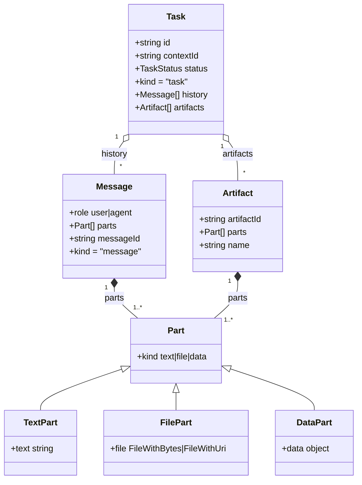

## 3.2 Agent Card：能力发现的基石

每个 A2A Agent 都在 `/.well-known/agent-card.json` 发布一张名片。任何想协作的 Agent **先 HTTP GET 拿到它，再决定是否委托任务**。这让整个系统**可插拔**：新加 Agent 只需发布 Card，调度 Agent 无需改代码即可发现并使用它。

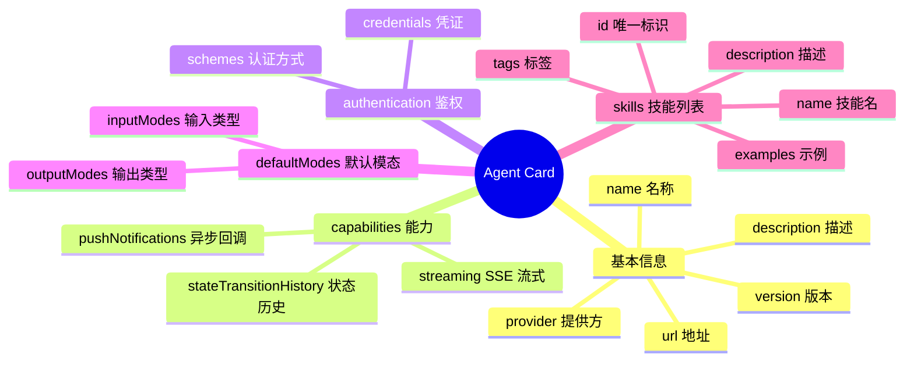

> **Skill 是最关键的字段。**每个 Skill 描述一类能力（如「竞品分析」「行业趋势分析」）并带示例输入。调度 Agent 正是用这些 Skill 描述做**任务路由决策**：「这个任务和哪个 Agent 的哪个 Skill 最匹配？」


## 3.3 Task 生命周期状态机

Task 是 A2A 的「一等公民」。它被设计为支持**长时间任务**：调度 Agent 提交后可去做别的事，通过轮询或推送通知得知完成。其状态流转如下：

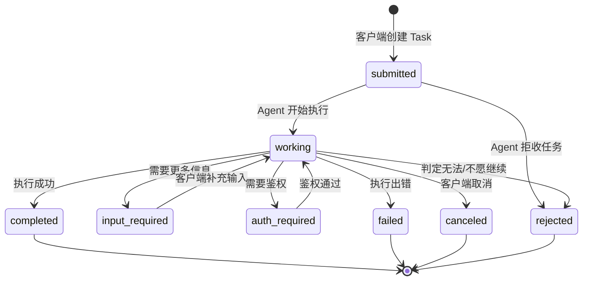

| 状态 | 含义 |
|-|-|
| `submitted` | 已提交，等待处理 |
| `working` | 正在执行中 |
| `input-required` | 需要客户端补充更多信息才能继续（中断态，补充后回到 working） |
| `auth-required` | 需要完成鉴权才能继续（中断态，鉴权通过后回到 working） |
| `completed` | 已完成，可取 Artifact 结果（终态） |
| `canceled` | 被客户端取消（终态） |
| `failed` | 执行失败（终态） |
| `rejected` | Agent 拒绝执行：创建时拒收，或执行中判定无法/不愿继续（终态） |
| `unknown` | 未知状态 |

## 3.4 通信机制与异步支持

A2A 支持三种通信模式，核心价值在于**异步**——让客户端在处理长任务时不必阻塞等待：

| 机制 | 工作方式 | 适用场景 |
|-|-|-|
| **请求/响应** | 标准 JSON-RPC，同步返回（tasks/send） | 秒级快速任务 |
| **SSE 流式** | tasks/sendSubscribe，服务端持续推送状态与工件 | 需实时看进度的任务 |
| **Push Notification** | 客户端注册 webhook，任务完成后 Agent 主动回调 | 数分钟以上的长任务 |

**A2A 通信机制：三种可选传输协议绑定。**上表描述的是「交互时序」（同步 / 流式 / 回调）；而在**传输层**，最新 A2A 协议不再绑定单一协议，而是定义了三种功能对等的传输绑定，Agent 至少实现其一，并在 Agent Card 的 `supportedInterfaces` 中声明，客户端据此协商选择：

| 传输绑定 | 形态 | 特点与适用 |
|-|-|-|
| **JSON-RPC 2.0**  <br/>（over HTTP） | POST + JSON-RPC 请求体，流式用 SSE | 最通用、生态默认；`a2a-js` SDK 默认走此绑定，本文档示例均基于它 |
| **gRPC** | Protocol Buffers + HTTP/2 双向流 | 强类型、高性能、原生流式；适合内网高吞吐 Agent 间调用 |
| **HTTP+JSON / REST** | RESTful URL 路径 + JSON，流式用 SSE | 贴近传统 REST 习惯，易于用通用 HTTP 工具集成 |

> **功能对等原则：**三种绑定在方法语义、错误码、数据模型上必须**功能等价**——同一个操作（如 sendMessage / getTask / cancelTask）在任一协议下行为一致，只是「线上表示」不同。这让 A2A 既能兼容 REST 生态，又能在需要时切换到 gRPC 追求性能，而上层业务逻辑无需改动。传输与协商细节见规范。


## 3.5 完整交互流程（时序图）

下图展示一次典型的流式协作全过程：从发现能力到提交任务、流式推送、返回工件：

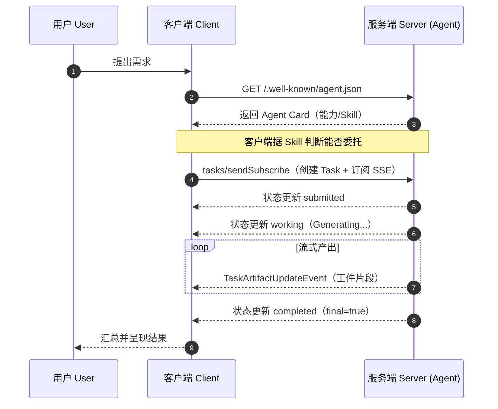

## 3.6 错误处理：标准 JSON-RPC 错误码

| 错误码 | 信息 | 描述 |
|-|-|-|
| `-32700` | JSON parse error | 发送了无效 JSON |
| `-32600` | Invalid Request | 请求负载校验错误 |
| `-32601` | Method not found | 非法方法 |
| `-32602` | Invalid params | 无效的方法参数 |
| `-32603` | Internal error | 内部 JSON-RPC 错误 |
| `-32001` | Task not found | 找不到指定 ID 的任务 |
| `-32002` | Task cannot be canceled | 任务无法被取消 |
| `-32003` | Push notifications not supported | Agent 不支持推送通知 |
| `-32004` | Unsupported operation | 操作不支持 |
| `-32005` | Incompatible content types | 内容类型不兼容 |

---

# 四、A2A 与微服务架构的对比

如果把每个 Agent 看作一个「会思考的服务」，A2A 几乎**照搬了微服务架构的治理思路**——把成熟的分布式系统方法论平移到了多 Agent 世界。二者的映射关系一目了然：

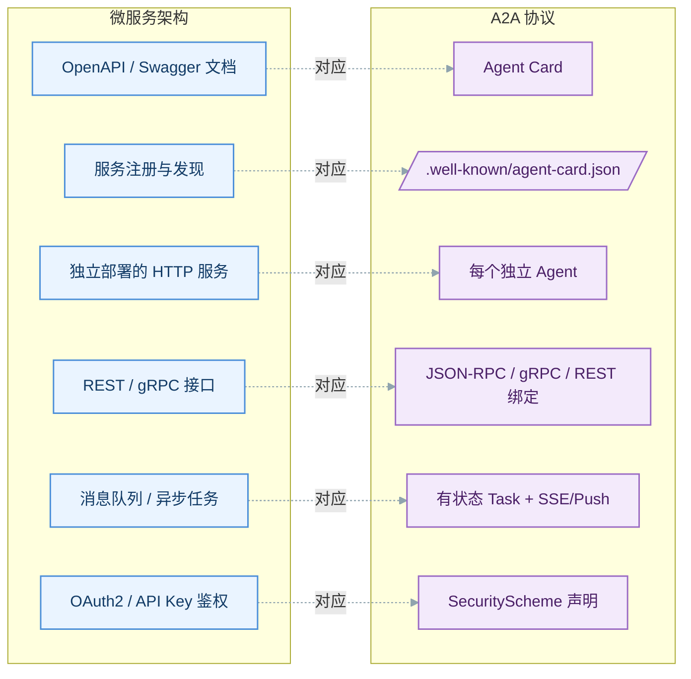

## 4.1 相似点逐项对照

| 维度 | 微服务架构 | A2A 协议 |
|-|-|-|
| **能力描述** | OpenAPI / Swagger 描述接口契约 | Agent Card 声明技能、输入输出模态与鉴权 |
| **服务发现** | 注册中心 / DNS 条目 | 约定路径 `/.well-known/agent-card.json` |
| **独立性** | 各服务独立部署、独立技术栈 | 各 Agent 独立进程，不绑框架、不绑语言 |
| **通信协议** | REST / gRPC / 消息协议多选 | JSON-RPC / gRPC / HTTP+JSON 三种对等绑定 |
| **异步与长任务** | 消息队列 + 回调 / 轮询 | 有状态 Task 状态机 + SSE 流式 + Push 回调 |
| **标准错误** | 统一 HTTP / gRPC 状态码 | 标准 JSON-RPC 错误码（-32700 等） |
| **安全鉴权** | OAuth2 / API Key / mTLS | SecurityScheme：OAuth2 / APIKey / HTTP / mTLS / OIDC |
| **松耦合** | 调用方只依赖接口契约，不关心实现 | Client 只依赖 Agent Card，Server 内部完全黑盒 |

## 4.2 相同的架构哲学

> **本质一致：**A2A 与微服务共享同一套「**契约先行 + 服务自治 + 标准通信 + 独立演进**」的分布式哲学。二者都用一份机器可读的契约（OpenAPI ↔ Agent Card）解决「发现与对接」，用标准协议解决「通信」，用松耦合边界让每个单元**独立开发、独立部署、独立扩缩容**。可以说 A2A 就是「**Agent 时代的微服务**」。


> **关键差异：**微服务接口大多是**确定性、无状态、秒级**的 RPC 调用；而 A2A 面向的是 Agent 之间**非确定性、有状态、可长时运行**的协作——因此额外引入了 Task 生命周期状态机、流式增量产出（Artifact）、多轮上下文（contextId）等微服务通常不具备的一等公民抽象。


---

# 五、A2A Client：发起协作的一方

Client 是**代表用户向远程 Agent 发起请求**的实体，可以是一个应用、一个调度 Agent 或命令行工具。它的职责可归纳为四步：**发现能力 → 提交任务 → 接收流式更新 → 汇总结果**。

## 4.1 Client 的核心职责

| 职责 | 做什么 | 对应方法 |
|-|-|-|
| **能力发现** | GET 远程 Agent 的 Agent Card，判断能否委托 | `agentCard()` |
| **提交任务** | 构造 Message 与 Task，通过 JSON-RPC 发送 | `sendTask()` |
| **订阅流式** | 建立 SSE 连接，持续接收状态与工件 | `sendTaskSubscribe()` |
| **查询/取消** | 轮询任务状态或主动取消 | `getTask()` / `cancelTask()` |

## 4.2 Client 内部结构

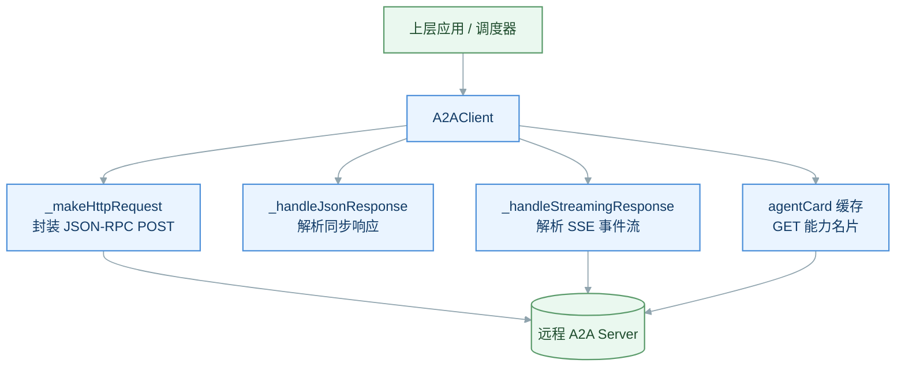

## 4.3 SSE 流式响应的解析

流式是 Client 最关键的能力。服务端以 `text/event-stream` 持续推送，Client 需按 `\n\n` 切分事件、剥离 `data:` 前缀、逐条 JSON 解析，并根据 `final` 标志决定何时结束。

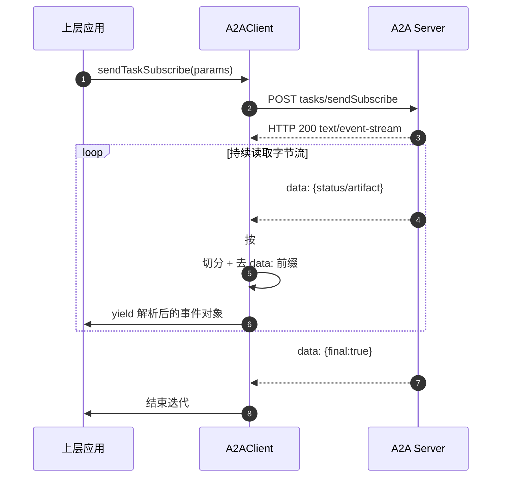

> **实现要点：**Client 用 **异步生成器（async generator）** 把 SSE 事件逐条 `yield` 给上层，上层用 `for await` 消费。Agent Card 一般会**本地缓存**，避免每次协作都重复拉取。


---

# 六、A2A Server：提供能力的一方

Server 是一个**不透明（黑盒）的远程 Agent**——对外只暴露能力，内部实现完全隐藏。它基于 HTTP 框架（如 Express）搭建，核心是**两个端点 + 一个 JSON-RPC 路由 + 一个异步任务处理器**。

## 5.1 Server 的两个 HTTP 端点

| 端点 | 方法 | 作用 |
|-|-|-|
| `/.well-known/agent-card.json` | GET | 发布 Agent Card，供 Client 发现能力 |
| `/`（basePath） | POST | 接收所有 JSON-RPC 请求，按 method 路由 |

## 5.2 Server 内部处理架构

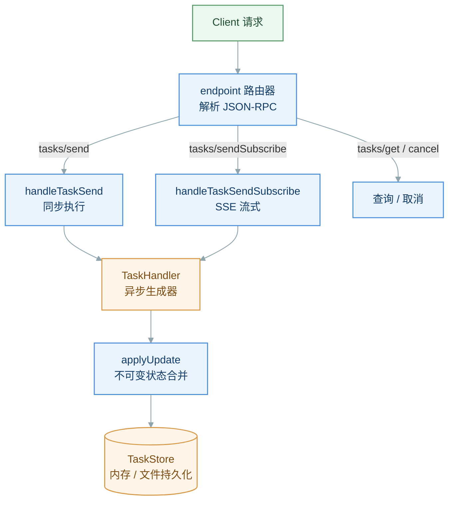

## 5.3 核心方法路由

| 方法 | 返回形式 | 说明 |
|-|-|-|
| `tasks/send` | 同步 JSON | 提交任务，一次性返回最终结果 |
| `tasks/sendSubscribe` | SSE 流 | 提交并订阅，持续推送状态与工件 |
| `tasks/get` | 同步 JSON | 按 ID 查询任务当前状态 |
| `tasks/cancel` | 同步 JSON | 取消指定任务 |
| `tasks/pushNotification/set\|get` | 同步 JSON | 配置 / 查询推送回调 |
| `tasks/resubscribe` | SSE 流 | 断线后重新订阅任务流 |

## 5.4 异步生成器：TaskHandler 的核心范式

Server 把每个 Agent 的业务逻辑实现为一个**异步生成器函数**。它接收 `TaskContext`（任务、用户消息、取消标志、历史），在执行过程中不断 `yield` 出「状态更新」或「工件片段」，框架负责把这些 yield 转成 SSE 事件推给 Client。

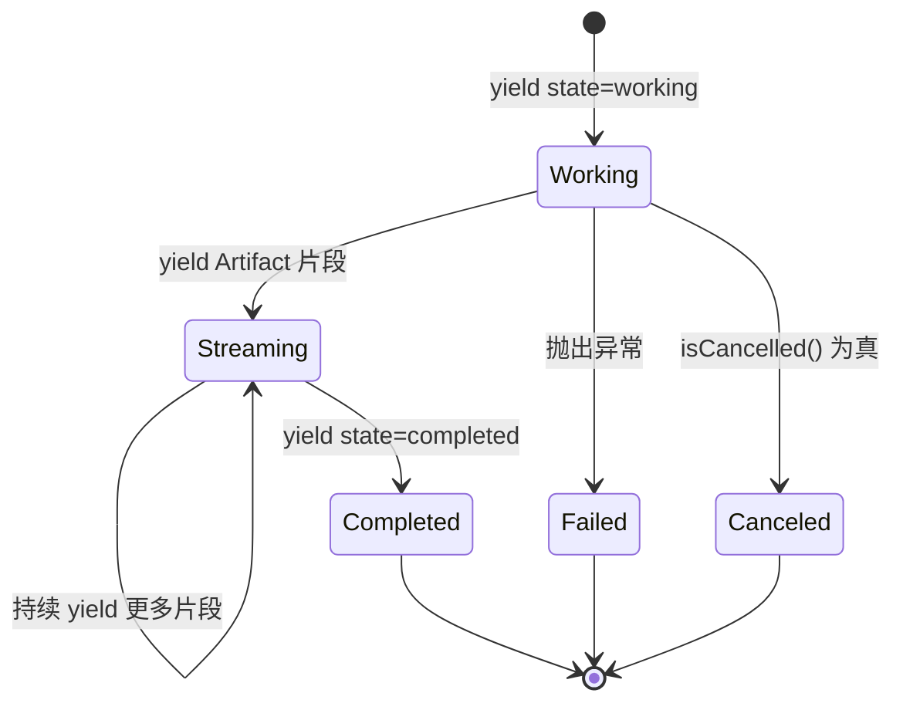

> **设计精髓：**用异步生成器把「长任务的中间进度」自然表达为一串 `yield`，框架无需关心业务细节，只需把每次 yield 落库（TaskStore）并转发为 SSE 事件。这让**业务逻辑**与**传输/持久化**彻底解耦。


## 5.5 状态存储：TaskStore

| 实现 | 特点 |
|-|-|
| `InMemoryTaskStore` | Map 存储，返回副本防止外部篡改；进程重启即丢失，适合开发/测试 |
| `FileStore` | 任务与历史分文件持久化（`.a2a-tasks` 目录），防目录穿越，适合生产落盘 |

---

# 七、A2A 实践：以 LangGraph A2A Demo（TypeScript + Node.js）项目为例

> Demo 仓库地址：https://github.com/lugezuishuai/a2a_demo


本节以当前项目 `langgraph-a2a-demo` 为例，说明如何用 TypeScript、Node.js、LangChain.js、LangGraph 与官方 `@a2a-js/sdk` 搭建一个可运行、可调试、可验证的 A2A 1.0 Client / Server 闭环。它不是“Client 直接调接口”的薄封装：Client 本身也是一个 LangGraph Agent，会先理解用户意图，再按语义选择本地回应或通过 A2A 委派给 Server Agent。

## 7.1 项目整体架构：Client Agent 与 Server Agent 的协作

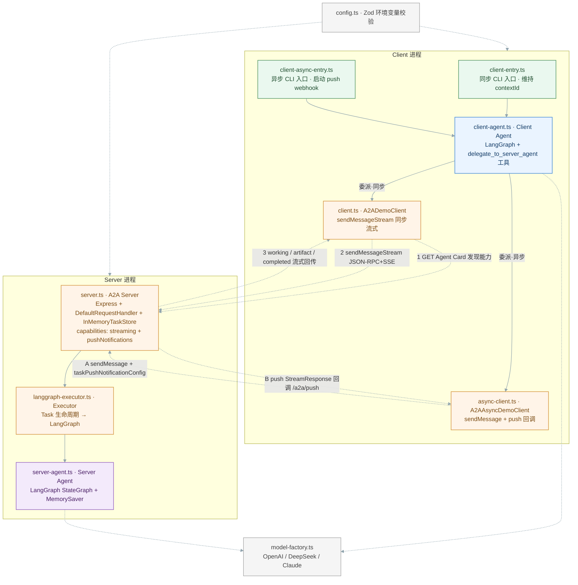

| 分层 | 核心文件 | 职责 |
|-|-|-|
| **交互入口层** | `client-entry.ts` / `client-async-entry.ts` | 读取终端输入、维持多轮 `contextId`；分别对应同步流式与异步推送两种接入入口 |
| **Client Agent 层** | `client-agent.ts` | 理解意图，决定本地回答或 A2A 委派（同步、异步复用同一 Agent） |
| **A2A 协议层** | `client.ts` / `async-client.ts` / `server.ts` / `langgraph-executor.ts` | Agent Card 发现、JSON-RPC 传输、同步 SSE 流式与异步 push 回调事件收发 |
| **Server Agent 层** | `server-agent.ts` | 用 LangGraph 执行实际任务并保存会话状态 |

> **解耦要点：**业务 Agent 不感知 HTTP / 协议协商 / 事件格式，A2A Client 也不理解模型推理细节；两者通过 **Agent Card + JSON-RPC + SSE** 三者衔接。`config.ts` 与 `model-factory.ts` 作为横切基础设施，同时服务于 Client 与 Server 两个进程。


## 7.2 关键代码模块与职责映射

| 文件 | 职责 | 在协作链路中的位置 |
|-|-|-|
| `src/config.ts` | 用 Zod 校验环境变量，统一模型、Key、超时、重试、Server URL、`MAX_TOKENS` 与 push webhook 地址。 | 运行配置入口 |
| `src/model-factory.ts` | 根据 Provider 创建 `ChatOpenAI` 或 `ChatAnthropic`；DeepSeek 默认使用官方兼容地址。 | 模型适配层 |
| `src/client-entry.ts` | 同步入口：支持单次命令与交互循环，通过 `sendMessageStream` 在同一连接消费 A2A 事件。 | 同步 Client CLI 入口 |
| `src/client-async-entry.ts` | 异步入口：启动本地 push webhook，复用同一 Client Agent，改由 push notification 回填结果。 | 异步 Client CLI 入口 |
| `src/client-agent.ts` | 构建 Client LangGraph；向模型提供 `delegate_to_server_agent` 工具，同步/异步共用。 | 语义路由与委派决策 |
| `src/client.ts` | 封装 Agent Card 发现、JSON-RPC transport 工厂与事件归一化，并实现 `sendMessageStream` 同步流式客户端。 | 同步 A2A Client 核心 |
| `src/async-client.ts` | 启动本地 `/a2a/push` webhook，发送 `taskPushNotificationConfig` + `returnImmediately` 请求，并按 token 聚合 push 事件为最终结果。 | 异步 A2A Client 核心 |
| `src/langchain-stream-helpers.ts` | 从 LangChain / LangGraph 流式 chunk 中统一提取可展示文本。 | 流式文本辅助 |
| `src/a2a-helpers.ts` | 构造文本 Part，提取 Message 与 Artifact 中的文本。 | 协议数据辅助 |
| `src/server-entry.ts` | 装配配置、模型、Server Agent、Executor 与 Express Server，并优雅关停。 | Server 进程入口 |
| `src/server.ts` | 构建 Agent Card（声明 streaming 与 pushNotifications 能力），注册健康检查、Agent Card 发现与 JSON-RPC 路由。 | A2A Server 边界 |
| `src/langgraph-executor.ts` | 把 A2A Task / Message 转换为 LangGraph 执行，并产出状态和 Artifact 更新（同步/异步共用同一执行器）。 | 协议与业务适配层 |
| `src/server-agent.ts` | 维护 Server Agent 的 LangGraph 对话和同一 `contextId` 的会话状态。 | Server 业务 Agent |
| `src/doctor.ts` | 校验 Node、配置、网络与 Agent Card 可达性，便于本地排障。 | 运行前诊断 |

## 7.3 Agent Card：从发布到被 Client 消费

Agent Card 在 Server 启动时被构建和发布，在 Client 发起实际 A2A 委派时被消费。`buildAgentCard(config)` 生成 Agent 名称、技能、能力、输入输出模式和 `supportedInterfaces`；其中接口 URL 使用 `A2A_PUBLIC_URL`，确保容器或反向代理部署时对外地址正确。随后 `createA2AServer()` 用 SDK 常量 `AGENT_CARD_PATH` 注册发现路由。

```ts
const agentCard = buildAgentCard(config);
const requestHandler = new DefaultRequestHandler(
  agentCard,
  new InMemoryTaskStore(),
  executor,
);

app.use(`/${AGENT_CARD_PATH}`,
  agentCardHandler({ agentCardProvider: requestHandler }));
app.use(jsonRpcHandler({
  requestHandler,
  userBuilder: UserBuilder.noAuthentication,
}));
```

当前 `@a2a-js/sdk` 的 `AGENT_CARD_PATH` 为 `.well-known/agent-card.json`，所以本地调试的完整地址是 `http://127.0.0.1:10000/.well-known/agent-card.json`。线上环境应使用 `https://<domain>/.well-known/agent-card.json`。旧版材料中常见的 `/.well-known/agent-card.json` 是历史路径；本项目遵循当前 A2A 1.0 的 `agent-card.json` 标准。

当 Client Agent 决定调用 `delegate_to_server_agent` 时，工具会调用 `A2ADemoClient.send()`，再进入 `stream()`。其中 `ClientFactory.createFromUrl(serverUrl)` 会先拉取并解析 Agent Card，再依据 `supportedInterfaces` 与 `preferredTransports: ['JSONRPC']` 选择 JSON-RPC 服务地址；只有完成发现和协议选择后，才调用 `sendMessageStream()` 发送 Task。

```ts
const client = await this.factory.createFromUrl(this.serverUrl);

for await (const response of client.sendMessageStream(request)) {
  const event = normalizeStreamResponse(response);
  if (event) yield event;
}
```

这也意味着：如果 Client Agent 把一个问候或澄清问题留在本地回答，则不会触发 Agent Card 发现；只有发生远端委派才会访问该端点。

## 7.4 一次完整的 A2A 交互流程

以用户输入"用三句话解释 A2A 协议"为例（同步模式），Client Agent 将其判定为实质性请求并调用委派工具。Client 发现 Server 的 Agent Card，选择 JSON-RPC 接口，随后以 `sendMessageStream` 流式发送消息；Server 在同一连接上创建并维护 Task，将请求交给 LangGraph Server Agent，最终把状态、文本消息或 Artifact 更新以 SSE 逐条回传。异步推送模式的差异见下一节。


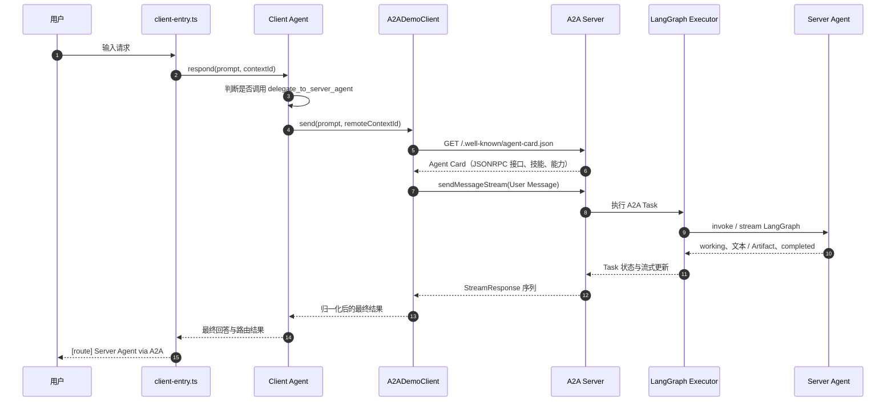

多轮时，`client-entry.ts` 保留 Client 侧 `contextId`，而 `client-agent.ts` 用 Map 保存每个 Client 会话对应的远端 A2A `contextId`。下一条委派请求会携带该远端上下文，因此 Server Agent 可以延续同一段对话；不同 Client 会话之间不会串线。

## 7.5 异步推送模式：sendMessage + push notification 回调

除了在同一连接上消费 SSE 的同步流式模式，项目还提供了一条**异步推送**链路：Client 发出请求后立即拿到 Task 创建响应，Server 在后台执行，完成后通过 push notification 回调 Client 本地的 webhook 回填结果。二者复用同一个 Client Agent、同一个 `createJsonRpcClientFactory` 与同一个 Server 端 Executor，仅在"如何拿结果"这一层不同。

| 维度 | 同步流式（SSE） | 异步推送（Push Notification） |
|-|-|-|
| **入口** | `client-entry.ts` · `npm run client` | `client-async-entry.ts` · `npm run client:async` |
| **核心客户端** | `A2ADemoClient`（client.ts） | `A2AAsyncDemoClient`（async-client.ts） |
| **发送方法** | `sendMessageStream`，同一连接上持续接收事件 | `sendMessage` + `returnImmediately: true`，立即返回首个 Task |
| **结果获取** | 逐条消费 SSE StreamResponse 直至终态 | Server 回调本地 `/a2a/push` webhook，按 token 聚合事件 |
| **关键配置** | 无需额外配置 | `taskPushNotificationConfig`（回调 URL + token）+ `A2A_PUSH_*` 环境变量 |
| **适用场景** | 实时交互、期望增量输出、连接可长时保持 | 长耗时任务、Client 不宜挂起连接、需后台执行后回调 |

异步入口在启动时用 Express 在本地拉起一个 push webhook（默认 `http://127.0.0.1:10001/a2a/push`），发送请求时把该地址与一个随机 `token` 写入 `taskPushNotificationConfig`，并设置 `returnImmediately: true`；`sendMessage` 一拿到首个 Task 就返回，最终结果通过 Server 的 push 回调按 `token` 匹配回填，到达终态（`COMPLETED` / `FAILED` / `CANCELED` / `REJECTED`）时才 resolve。这依赖 Server 在 Agent Card 中声明的 `pushNotifications: true` 能力。

```ts
request.configuration = {
  acceptedOutputModes: ["text/plain", "task-status"],
  taskPushNotificationConfig: {
    url: this.options.callbackUrl,
    token,
    // ...
  },
  returnImmediately: true,
};

const firstResult = await client.sendMessage(request);
// 最终结果由本地 /a2a/push webhook 按 token 回填
return pendingResult;
```

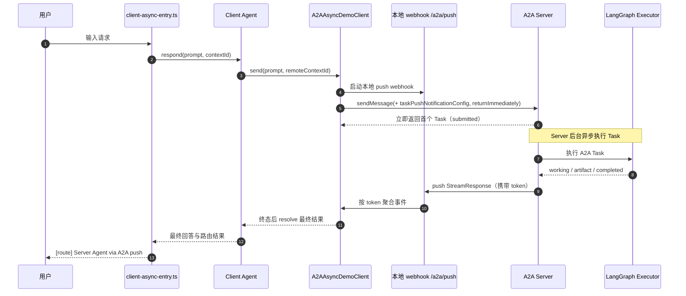

## 7.6 配置、运行、调试与验证

所有可变信息都由环境变量注入，避免将模型名称或密钥写入源码。先执行 `npm run env:init` 由 `.env.example` 初始化 `.env`；如 `.env` 已存在，原内容不会被覆盖。

| 配置类别 | 关键环境变量 | 说明 |
|-|-|-|
| 模型与鉴权 | `MODEL_PROVIDER`、`MODEL`、`API_KEY` | 支持 `openai/gpt`、`deepseek`、`anthropic/claude`；也可使用 Provider 专属 Key。 |
| 模型行为 | `BASE_URL`、`MODEL_TEMPERATURE`、`MAX_TOKENS`、`MODEL_TIMEOUT_MS`、`MODEL_MAX_RETRIES` | `MAX_TOKENS` 为可选正整数；为空时由模型 Provider 使用默认值。 |
| DeepSeek | `MODEL_PROVIDER=deepseek`、`MODEL=deepseek-v4-flash` | 默认使用 `https://api.deepseek.com`;仅 `deepseek-v4-flash` 显式设置 `useResponsesApi: true`,其他 DeepSeek 模型走 Chat Completions。 |
| A2A 地址 | `SERVER_HOST`、`SERVER_PORT`、`A2A_PUBLIC_URL`、`A2A_SERVER_URL` | `A2A_PUBLIC_URL` 写入 Agent Card;Client 通过 `A2A_SERVER_URL` 或 `--url` 定位远端服务。 |
| 异步推送 | `A2A_PUSH_HOST`、`A2A_PUSH_PORT`、`A2A_PUSH_PUBLIC_URL`、`A2A_PUSH_TIMEOUT_MS` | 仅异步模式使用;指定本地 push webhook 的监听地址、对 Server 可达的回调地址与等待超时(默认 120000ms)。 |

```bash
npm install
npm run env:init
# 编辑 .env，填写模型与 Key
npm run doctor
npm run dev

# 新开终端：同步流式（SSE）单次请求
npm run client -- "用三句话解释 A2A 协议"

# 或进入可连续输入多条指令的交互模式
npm run client

# 异步推送模式：Server 后台执行后回调本地 webhook
npm run client:async -- "用三句话解释 A2A 协议"

# 静态检查、真实本地协议闭环测试与构建
npm run check
npm test
npm run build
```

Trae 可直接启动 Compound 配置 `A2A: Debug Client + Server`，它会同时启动 Server 与交互式 Client，并在停止时一并结束。建议在 `src/client.ts` 的 `createFromUrl(this.serverUrl)` 处设置断点观察 Agent Card 的消费；在 `src/server.ts` 的 Agent Card 路由处设置断点观察发现请求；再在 `src/client-agent.ts` 的委派工具和 `src/langgraph-executor.ts` 中查看语义路由、Task 执行与流式产出。

**验证标准：**集成测试会在随机本地端口启动真实 Express Server，依次读取 `/.well-known/agent-card.json`、发送 JSON-RPC 消息、消费 task / status / artifact 流式事件，并断言最终状态为 `TASK_STATE_COMPLETED`。测试使用确定性的 LangChain fake model，因此不需要真实 API Key。
