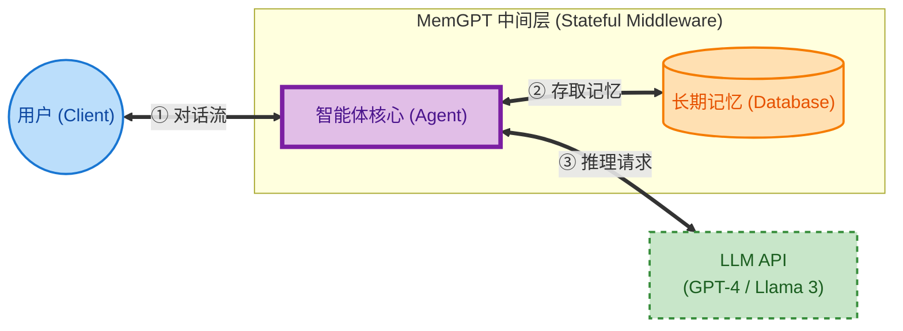
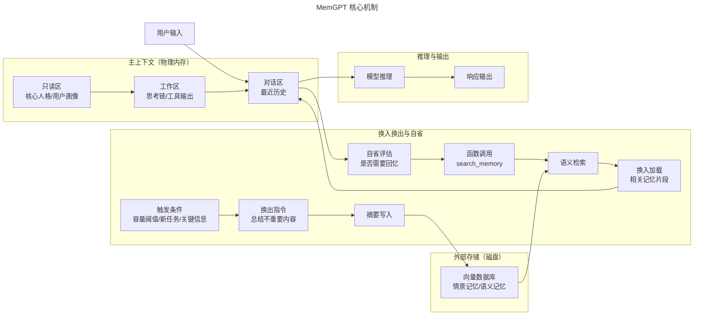
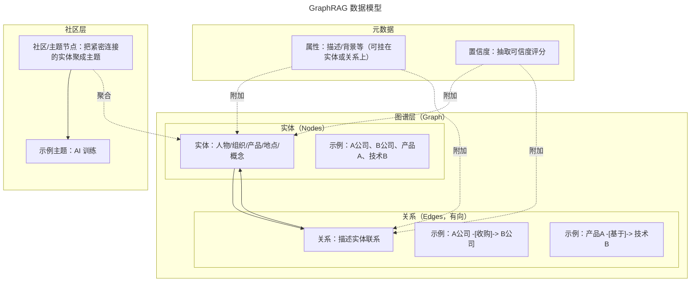
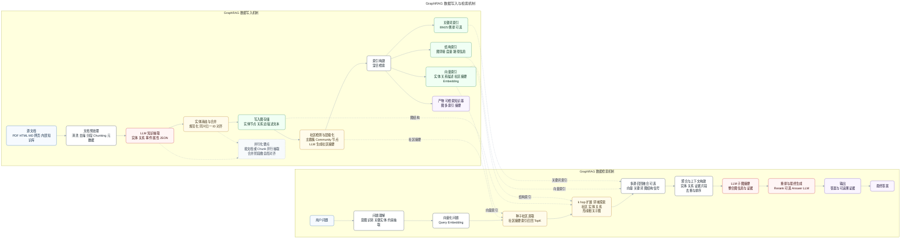
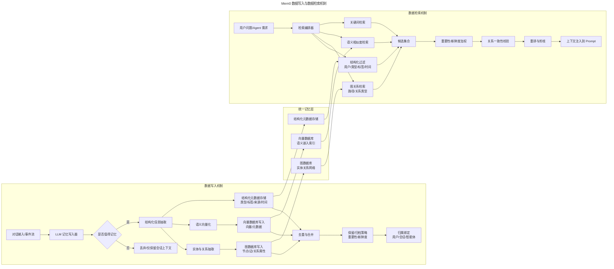
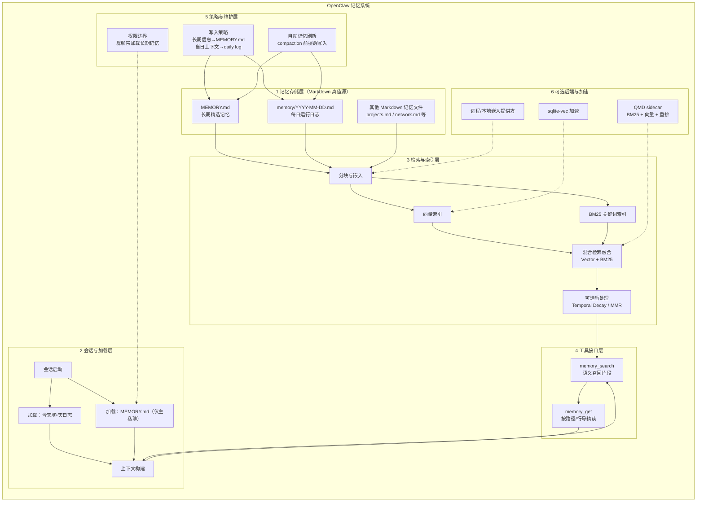

## MemGPT（Letta）

> 📚 https://docs.letta.com/guides/get-started/intro/

### 核心理念

将 LLM 的**固定上下文窗口类比为计算机的“物理内存（RAM）”，而将外部的向量数据库等存储类比为“磁盘”**。MemGPT 扮演的角色则是一个“**内存管理器**”，负责在两者之间高效、智能地换入换出（Page In / Page Out）信息。

### 整体流程

## GraphRAG

> 💡 延伸阅读：**GraphRAG**

### 核心理念

GraphRAG 通过在 RAG 流程之前引入知识图谱构建步骤，有效解决了传统 RAG 的两大痛点：

1. **克服语义鸿沟**：传统 RAG 依赖向量相似度，常常检索到语义相似但逻辑无关的“噪声”信息。GraphRAG 将非结构化文本转化为结构化的实体和关系网络，检索时不再是寻找模糊的“相似文本”，而是在这个网络中寻找逻辑上强相关的“知识路径”。这使得检索结果与查询意图的关联性更强，显著提升了上下文的质量。
2. **支持多跳推理与复杂问题分解**：对于需要综合多个信息点才能回答的复杂问题（如“A 公司的产品 B 与 C 公司的产品 D 有哪些竞争关系？”），传统 RAG 往往力不从心。GraphRAG 则可以将这类问题分解为图上的查询路径，通过遍历实体间的关系来发现隐藏的、深度的关联，为多跳推理提供了坚实的基础。

- **实体 (Entities)**：从文本中抽取的关键名词，如人物、组织、产品、地点、概念等。每个实体都是图中的一个节点。
- **关系 (Relationships)**：连接实体的有向边，描述实体之间的具体联系，如 `(A公司) -[收购]-> (B公司)`，`(产品A) -[基于]-> (技术B)`。
- **社区/主题节点 (Communities / Topics)**：通过社区检测算法（如 Leiden 或 Louvain）**将图中紧密连接的实体聚类，形成更高层次的“主题”或“社区”节点**。例如，多个关于“机器学习模型”和“训练数据”的实体可能被归入一个名为“AI 训练”的社区。这为宏观、概要性的查询提供了入口。
- **属性与置信度 (Attributes & Confidence)**：实体和关系都可以拥有详细的属性，如实体的描述、关系发生的背景等。同时，每个由 LLM 抽取出的元素都附带一个置信度分数，用于评估其可靠性。

### 整体流程

### 数据写入机制

GraphRAG 的数据写入是一个**由 LLM 驱动的、从非结构化到结构化**的自动化构建流程：

1. **LLM 驱动的知识抽取**：系统遍历所有源文档，通过精心设计的 Prompt 指导 LLM 以 JSON 格式抽取出文中的所有实体和关系。这一步通常是并行的，以处理海量文档。
2. **实体消歧与合并 (Entity Disambiguation & Merging)**：LLM 会对抽取出的实体进行标准化处理，识别并合并指代同一事物的不同表述（如“Apple Inc.”、“苹果公司”和“Apple”应被合并为同一个实体节点）。
3. **社区检测与层级化**：在所有实体和关系被导入图数据库后，系统运行社区检测算法，自动发现图中的主题簇，并生成社区节点。这些社区节点可以被赋予一个由 LLM 生成的、能够概括该社区内容的描述性名称。
4. **全局与局部索引构建**：最后，系统会为图中的实体、关系描述以及社区摘要分别创建向量索引和关键词索引，以支持后续的混合检索。

### 数据检索机制

GraphRAG 的检索是一个多层次、从宏观到微观的探索过程：

1. **种子节点选取 (Seed Node Selection)**：当用户提出问题时，系统首先将问题向量化，在**社区摘要**的向量索引中进行搜索，找到与问题最相关的几个宏观主题社区。
2. **k-hop 扩展与邻域探索 (k-hop Expansion & Neighborhood Exploration)**：从选定的社区节点出发，系统开始在图上进行 k-hop 遍历，探索与这些社区直接或间接相关的实体和关系，形成一个与查询问题高度相关的“子图”。
3. **聚合、摘要与上下文构建 (Aggregation, Summarization & Context Construction)**：系统将这个子图中的所有实体、关系、以及它们的描述性文本聚合起来。然后，通过另一个 LLM Prompt，将这些零散的图信息整合成一段或多段通顺、连贯的自然语言摘要。
4. **重排与最终生成 (Reranking & Final Generation)**：生成的摘要作为高质量的上下文，与原始问题一起被送入最终的问答 LLM，生成精确的答案。

## Mem0

> 💡 https://github.com/mem0ai/mem0

### 流程

### 数据写入机制

Mem0 的写入过程是一个智能化的过滤与评估流程：

1. **LLM 记忆写入器：** 在每次对话交互后，Mem0 会将最新的对话片段传递给一个**专门的“记忆写入器”LLM**。该 LLM 的任务是分析对话，判断其中是否包含值得记忆的信息。
2. **结构化信息抽取：** 如果检测到可记忆内容，LLM 会将记忆抽取为结构化数据（类型、来源、上下文、标签等），并为其分配初始的重要性评分。
3. **实体与关系抽取：** 从记忆中识别出关键实体与关系，写入图数据库，形成可查询的关系网络。
4. **语义向量化：** 将记忆内容或实体描述向量化，写入向量数据库，建立相似度检索索引。
5. **去重与合并：** 写入前进行相似性搜索与关系校验，发现高度相似或可合并的记忆时，更新旧记忆的内容与时间信息。
6. **保留/失效策略：** 根据重要性与新鲜度执行归档或淘汰，维持记忆系统的质量与规模。
7. **租户与主体归属：** 所有记忆与用户、会话或智能体绑定，确保数据隔离与可控的权限边界。

### 数据检索机制

Mem0 的检索机制旨在平衡相关性、重要性和时效性，实现精准的“恰时回忆”：

1. **混合查询**：当 Agent 需要检索记忆时，它会结合多种查询方式：

   - **结构化过滤**：首先根据元数据进行筛选，例如“只检索该用户的、类型为‘偏好’的记忆”。
   - **语义检索**：将当前问题向量化，在过滤后的结果中进行向量相似度搜索。
   - **关键词检索**：支持对特定术语或名称的精确匹配。
2. **重要性与新鲜度加权**：检索到的结果会根据其**重要性评分**和**新鲜度评分**进行重排。这意味着，即使一个旧记忆在语义上稍微远一些，但如果它被标记为非常重要，其排名也可能高于一个非常相似但无关紧要的近期闲聊。
3. **关系一致性校验：** 对图关系检索结果进行一致性约束，确保实体与关系链路符合当前上下文。
4. **上下文剪枝与注入**：最终，排名靠前的记忆被格式化后，注入到提供给主 LLM 的 Prompt 中，作为决策的上下文依据。

## OpenClaw

> 💡 https://docs.openclaw.ai/zh-CN/concepts/memory

### 核心理念

使用 Markdown 文件存储原始的记忆，存放在 `~/.openclaw/workspace/MEMORY.md` 和 `~/.openclaw/workspace/memory/*.md` 文件中。记忆文件变更通过异步本地 SQLite 构建全文和向量索引，通过工具进行全文和向量混合检索。

### 整体流程

1. **存储形态：Markdown 作为唯一真值源**

   - 记忆数据以纯 Markdown 文件落盘，磁盘文件是唯一真值源
   - 模型只“记住”被写入磁盘的内容，不依赖隐藏的外部数据库
   - 默认工作区包含两类关键文件：

     - `MEMORY.md`：长期精选记忆，记录偏好、长期事实、关键决策与稳定约束
     - `memory/YYYY-MM-DD.md`：每日日志，追加式记录当天的上下文与进展
2. **记忆层级与加载策略**

   - 记忆分为长期记忆与短期工作记忆两层
   - 会话启动时优先加载**最近的 daily log（通常为今天与昨天）**，保证近期上下文连续
   - MEMORY.md 作为“长期事实”仅在主私聊会话加载，避免群聊场景暴露隐私
   - 这种分层可以在上下文窗口有限的情况下兼顾稳定知识与最新进展
3. **记忆工具接口**

   - **memory_search**：从已索引的记忆片段中召回相关内容

     - 输入：查询文本
     - 输出：片段内容、来源文件、行号范围、分数等元信息
     - 用途：语义回忆，适合找“相关内容”
   - **memory_get**：按路径与行号读取指定记忆内容

     - 输入：文件路径、起始行与行数
     - 输出：指定范围的原始文本
     - 用途：精准读取，适合“定位某个文件段落”
   - 两者搭配形成“先搜后读”的工作流：先用 memory_search 确定位置，再用 memory_get 精确读取
4. **索引与检索机制**

   - 向量索引

     - 对 Markdown 内容进行分块并生成向量嵌入
     - 通过向量相似度实现语义匹配
   - 混合检索

     - 将向量语义相似度与 BM25 关键词匹配结合
     - 既能理解“语义相近”，也能精准命中错误码、标识符等高信号词
5. **自动记忆刷新（防丢失）**

   - 会话接近自动压缩（compaction）时触发一次静默“写入提醒”
   - 目的：在压缩之前将可复用的长期信息落盘，避免“上下文被压缩后丢失”
   - 这使记忆写入与会话压缩解耦，提升长期可用性

## OpenViking

> 💡 https://github.com/volcengine/OpenViking
