> **一句话概括：**MCP（Model Context Protocol，模型上下文协议）是 Anthropic 于 2024 年 11 月开源的开放协议，用于解决**大模型 / Agent 如何以标准化方式连接外部工具、数据与上下文的问题。它把过去「每个模型 × 每个工具」都要单独适配的 M×N 集成难题，收敛成「一次适配、处处复用」的 M+N 标准接口——常被形容为「AI 应用的 USB-C 接口**」。


**阅读导航：**本文依次讲解 MCP 的概念、与 Function Calling 的区别、协议原理与交互流程、传输层分类，最后拆解 Client 与 Server 两端的角色、职责与实现。

---

# 一、什么是 MCP 协议

MCP（Model Context Protocol）是由 **Anthropic** 主导、社区共建的开放标准，目标是为「大模型应用」与「外部世界（工具、数据源、服务）」之间定义一套**统一、可复用、可发现**的通信契约。它让任意 LLM 应用都能以同一种方式接入任意兼容的数据源与工具，而无需为每个组合重复造轮子。

## 1.1 为什么需要 MCP：M×N 集成困境

在 MCP 出现之前，把 N 个工具接入 M 个 AI 应用，需要 **M×N 套**各不相同的定制集成——每换一个模型或新增一个工具，都要重写对接代码。MCP 引入一层标准协议后，工具方只需实现一次 Server、应用方只需实现一次 Client，集成复杂度从 **M×N 降到 M+N**。

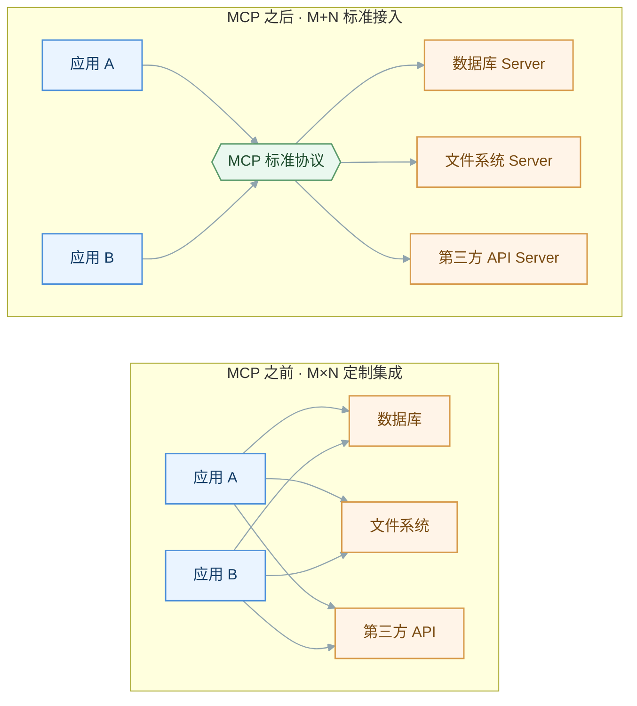
```mermaid
flowchart LR
    classDef app fill:#EAF4FF,stroke:#4C8FD9,stroke-width:1.5px,color:#123B66
    classDef tool fill:#FFF4E8,stroke:#D79A4A,stroke-width:1.5px,color:#7A4B12
    classDef hub fill:#EAF8EF,stroke:#5B9B6B,stroke-width:1.5px,color:#1F4D2E
    linkStyle default stroke:#90A4AE,stroke-width:1.2px

    subgraph BEFORE[MCP 之前 · M×N 定制集成]
        direction LR
        AP1[应用 A]:::app
        AP2[应用 B]:::app
        TL1[数据库]:::tool
        TL2[文件系统]:::tool
        TL3[第三方 API]:::tool
        AP1 --> TL1
        AP1 --> TL2
        AP1 --> TL3
        AP2 --> TL1
        AP2 --> TL2
        AP2 --> TL3
    end

    subgraph AFTER[MCP 之后 · M+N 标准接入]
        direction LR
        BP1[应用 A]:::app --> MCP{{MCP 标准协议}}:::hub
        BP2[应用 B]:::app --> MCP
        MCP --> BT1[数据库 Server]:::tool
        MCP --> BT2[文件系统 Server]:::tool
        MCP --> BT3[第三方 API Server]:::tool
    end
```

> **核心价值：**MCP 之于 AI 应用，正如 USB-C 之于电子设备、LSP（语言服务器协议）之于 IDE——用一套标准接口取代五花八门的私有对接，让「工具生态」与「模型生态」解耦，各自独立演进、自由组合。


## 1.2 MCP 的三大参与者

MCP 采用经典的**客户端-主机-服务器（Client-Host-Server）**三方架构。与只定义「Client-Server」两端的协议不同，MCP 额外抽象出 **Host** 这一层，用于承载 LLM、编排多个连接并统一管理安全边界。

| 参与者 | 角色定位 | 职责 |
|-|-|-|
| **主机 Host** | LLM 应用本体（如 Claude Desktop、IDE 插件、Agent 框架） | 承载大模型、发起连接、聚合多个 Server 的能力、把控用户授权与安全边界 |
| **客户端 Client** | Host 内部与单个 Server 一一对应的连接器 | 维护与某个 Server 的 1:1 会话，负责协议协商、消息收发、能力路由 |
| **服务端 Server** | 独立的能力提供方（进程 / 服务） | 对外暴露 Tools / Resources / Prompts，把真实的工具、数据、服务封装成标准接口 |

三者关系:一个 Host 内可持有**多个 Client**,**每个 Client 独占一条通往某个 Server 的连接**:

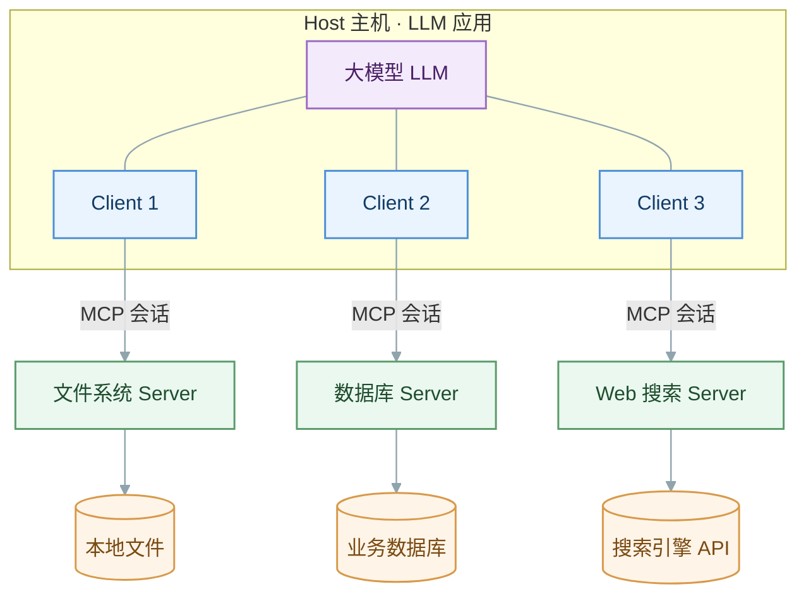
```mermaid
flowchart TB
    classDef host fill:#F3EAFB,stroke:#9B6BC4,stroke-width:1.5px,color:#4A1F66
    classDef client fill:#EAF4FF,stroke:#4C8FD9,stroke-width:1.5px,color:#123B66
    classDef server fill:#EAF8EF,stroke:#5B9B6B,stroke-width:1.5px,color:#1F4D2E
    classDef res fill:#FFF4E8,stroke:#D79A4A,stroke-width:1.5px,color:#7A4B12
    linkStyle default stroke:#90A4AE,stroke-width:1.2px

    subgraph HOST[Host 主机 · LLM 应用]
        LLM[大模型 LLM]:::host
        C1[Client 1]:::client
        C2[Client 2]:::client
        C3[Client 3]:::client
        LLM --- C1
        LLM --- C2
        LLM --- C3
    end

    C1 -->|MCP 会话| S1[文件系统 Server]:::server
    C2 -->|MCP 会话| S2[数据库 Server]:::server
    C3 -->|MCP 会话| S3[Web 搜索 Server]:::server

    S1 --> R1[(本地文件)]:::res
    S2 --> R2[(业务数据库)]:::res
    S3 --> R3[(搜索引擎 API)]:::res
```

## 1.3 MCP 的设计目标

| 设计目标 | 含义 |
|-|-|
| **标准化** | 用统一契约描述工具、资源与提示词，一次实现处处复用，消除 M×N 定制 |
| **能力发现** | Client 可在运行时动态列举 Server 提供的 Tools / Resources / Prompts，无需硬编码 |
| **安全可控** | 通过 Host 统一管理授权，敏感操作需用户批准；Server 只暴露被显式授予的能力 |
| **传输无关** | 协议语义与传输层解耦，可跑在本地 stdio、也可跑在远程 HTTP，业务逻辑不变 |
| **组合灵活** | 一个 Host 可同时连接多个 Server，把不同来源的能力自由拼装成完整应用 |

## 1.4 MCP JSON-RPC 方法字段定义与 JSON Schema

MCP 的所有交互都建立在 **JSON-RPC 2.0** 之上。下面先给出通用消息信封，再逐一列出各方法的字段定义（表格）与 JSON Schema（代码块）。所有请求/响应都隐含 `"jsonrpc": "2.0"` 字段。

### 1.4.1 JSON-RPC 2.0 通用信封

| 字段 | 类型 | 必填 | 说明 |
|-|-|-|-|
| jsonrpc | string | 是 | 协议版本，固定为 "2.0" |
| id | string \| number | 请求/响应必填；通知不含 | 请求标识，响应需回带同一 id；通知（notification）无 id |
| method | string | 请求/通知必填 | 方法名，如 initialize、tools/call |
| params | object | 否 | 方法入参 |
| result | object | 成功响应必填 | 成功时的返回体，与 error 互斥 |
| error | object | 失败响应必填 | 失败时的错误体，与 result 互斥；含 code(number)、message(string)、data(可选) |

```json
{
  "$schema": "http://json-schema.org/draft-07/schema#",
  "oneOf": [
    {
      "title": "Request",
      "type": "object",
      "properties": {
        "jsonrpc": { "const": "2.0" },
        "id": { "type": ["string", "number"] },
        "method": { "type": "string" },
        "params": { "type": "object" }
      },
      "required": ["jsonrpc", "id", "method"]
    },
    {
      "title": "Notification",
      "type": "object",
      "properties": {
        "jsonrpc": { "const": "2.0" },
        "method": { "type": "string" },
        "params": { "type": "object" }
      },
      "required": ["jsonrpc", "method"],
      "not": { "required": ["id"] }
    },
    {
      "title": "Response",
      "type": "object",
      "properties": {
        "jsonrpc": { "const": "2.0" },
        "id": { "type": ["string", "number", "null"] },
        "result": { "type": "object" },
        "error": {
          "type": "object",
          "properties": {
            "code": { "type": "integer" },
            "message": { "type": "string" },
            "data": {}
          },
          "required": ["code", "message"]
        }
      },
      "required": ["jsonrpc", "id"],
      "oneOf": [{ "required": ["result"] }, { "required": ["error"] }]
    }
  ]
}
```

### 1.4.2 initialize（初始化握手）

| 字段（params） | 类型 | 必填 | 说明 |
|-|-|-|-|
| protocolVersion | string | 是 | Client 支持的协议版本，如 "2025-03-26" |
| capabilities | object | 是 | Client 能力声明，如 roots、sampling |
| clientInfo | object | 是 | 客户端信息，含 name、version |
| result.protocolVersion | string | 是 | Server 最终采用的协议版本 |
| result.capabilities | object | 是 | Server 能力声明，如 tools、resources、prompts、logging |
| result.serverInfo | object | 是 | 服务端信息，含 name、version |
| result.instructions | string | 否 | 给模型的使用说明 |

```json
{
  "request": {
    "type": "object",
    "properties": {
      "method": { "const": "initialize" },
      "params": {
        "type": "object",
        "properties": {
          "protocolVersion": { "type": "string" },
          "capabilities": {
            "type": "object",
            "properties": {
              "roots": { "type": "object", "properties": { "listChanged": { "type": "boolean" } } },
              "sampling": { "type": "object" }
            }
          },
          "clientInfo": {
            "type": "object",
            "properties": { "name": { "type": "string" }, "version": { "type": "string" } },
            "required": ["name", "version"]
          }
        },
        "required": ["protocolVersion", "capabilities", "clientInfo"]
      }
    }
  },
  "result": {
    "type": "object",
    "properties": {
      "protocolVersion": { "type": "string" },
      "capabilities": {
        "type": "object",
        "properties": {
          "tools": { "type": "object", "properties": { "listChanged": { "type": "boolean" } } },
          "resources": { "type": "object", "properties": { "subscribe": { "type": "boolean" }, "listChanged": { "type": "boolean" } } },
          "prompts": { "type": "object", "properties": { "listChanged": { "type": "boolean" } } },
          "logging": { "type": "object" }
        }
      },
      "serverInfo": {
        "type": "object",
        "properties": { "name": { "type": "string" }, "version": { "type": "string" } },
        "required": ["name", "version"]
      },
      "instructions": { "type": "string" }
    },
    "required": ["protocolVersion", "capabilities", "serverInfo"]
  }
}
```

### 1.4.3 ping（心跳探活）

| 字段 | 类型 | 必填 | 说明 |
|-|-|-|-|
| method | string | 是 | 固定为 "ping" |
| params | object | 否 | 通常为空 |
| result | object | 是 | 空对象 {}，表示对端存活 |

```json
{
  "request": {
    "type": "object",
    "properties": {
      "method": { "const": "ping" },
      "params": { "type": "object" }
    },
    "required": ["method"]
  },
  "result": { "type": "object", "additionalProperties": false }
}
```

### 1.4.4 tools/list（列出工具）

| 字段 | 类型 | 必填 | 说明 |
|-|-|-|-|
| params.cursor | string | 否 | 分页游标 |
| result.tools | array | 是 | 工具列表 |
| tools[].name | string | 是 | 工具唯一名称 |
| tools[].description | string | 否 | 工具用途描述 |
| tools[].inputSchema | object | 是 | 入参的 JSON Schema |
| result.nextCursor | string | 否 | 下一页游标，无则表示结束 |

```json
{
  "request": {
    "type": "object",
    "properties": {
      "method": { "const": "tools/list" },
      "params": { "type": "object", "properties": { "cursor": { "type": "string" } } }
    }
  },
  "result": {
    "type": "object",
    "properties": {
      "tools": {
        "type": "array",
        "items": {
          "type": "object",
          "properties": {
            "name": { "type": "string" },
            "description": { "type": "string" },
            "inputSchema": { "type": "object" }
          },
          "required": ["name", "inputSchema"]
        }
      },
      "nextCursor": { "type": "string" }
    },
    "required": ["tools"]
  }
}
```

### 1.4.5 tools/call（调用工具）

| 字段 | 类型 | 必填 | 说明 |
|-|-|-|-|
| params.name | string | 是 | 要调用的工具名 |
| params.arguments | object | 否 | 符合该工具 inputSchema 的入参 |
| result.content | array | 是 | 返回内容块数组，支持 text / image / resource 等类型 |
| result.isError | boolean | 否 | true 表示工具执行内部报错（区别于协议层 error） |

```json
{
  "request": {
    "type": "object",
    "properties": {
      "method": { "const": "tools/call" },
      "params": {
        "type": "object",
        "properties": {
          "name": { "type": "string" },
          "arguments": { "type": "object" }
        },
        "required": ["name"]
      }
    }
  },
  "result": {
    "type": "object",
    "properties": {
      "content": {
        "type": "array",
        "items": {
          "type": "object",
          "properties": {
            "type": { "enum": ["text", "image", "audio", "resource"] },
            "text": { "type": "string" },
            "data": { "type": "string" },
            "mimeType": { "type": "string" }
          },
          "required": ["type"]
        }
      },
      "isError": { "type": "boolean" }
    },
    "required": ["content"]
  }
}
```

### 1.4.6 resources/list（列出资源）

| 字段 | 类型 | 必填 | 说明 |
|-|-|-|-|
| params.cursor | string | 否 | 分页游标 |
| result.resources | array | 是 | 资源列表 |
| resources[].uri | string | 是 | 资源唯一 URI |
| resources[].name | string | 是 | 资源名称 |
| resources[].description | string | 否 | 资源描述 |
| resources[].mimeType | string | 否 | 资源 MIME 类型 |
| result.nextCursor | string | 否 | 下一页游标 |

```json
{
  "request": {
    "type": "object",
    "properties": {
      "method": { "const": "resources/list" },
      "params": { "type": "object", "properties": { "cursor": { "type": "string" } } }
    }
  },
  "result": {
    "type": "object",
    "properties": {
      "resources": {
        "type": "array",
        "items": {
          "type": "object",
          "properties": {
            "uri": { "type": "string", "format": "uri" },
            "name": { "type": "string" },
            "description": { "type": "string" },
            "mimeType": { "type": "string" }
          },
          "required": ["uri", "name"]
        }
      },
      "nextCursor": { "type": "string" }
    },
    "required": ["resources"]
  }
}
```

### 1.4.7 resources/read（读取资源）

| 字段 | 类型 | 必填 | 说明 |
|-|-|-|-|
| params.uri | string | 是 | 要读取的资源 URI |
| result.contents | array | 是 | 资源内容数组 |
| contents[].uri | string | 是 | 内容对应的 URI |
| contents[].mimeType | string | 否 | MIME 类型 |
| contents[].text | string | 否 | 文本内容（与 blob 二选一） |
| contents[].blob | string | 否 | Base64 编码的二进制内容 |

```json
{
  "request": {
    "type": "object",
    "properties": {
      "method": { "const": "resources/read" },
      "params": {
        "type": "object",
        "properties": { "uri": { "type": "string", "format": "uri" } },
        "required": ["uri"]
      }
    }
  },
  "result": {
    "type": "object",
    "properties": {
      "contents": {
        "type": "array",
        "items": {
          "type": "object",
          "properties": {
            "uri": { "type": "string" },
            "mimeType": { "type": "string" },
            "text": { "type": "string" },
            "blob": { "type": "string", "contentEncoding": "base64" }
          },
          "required": ["uri"]
        }
      }
    },
    "required": ["contents"]
  }
}
```

### 1.4.8 resources/subscribe 与 resources/unsubscribe（订阅资源变更）

| 字段 | 类型 | 必填 | 说明 |
|-|-|-|-|
| method | string | 是 | "resources/subscribe" 或 "resources/unsubscribe" |
| params.uri | string | 是 | 订阅/取消订阅的资源 URI |
| result | object | 是 | 空对象 {}，表示操作成功 |

```json
{
  "request": {
    "type": "object",
    "properties": {
      "method": { "enum": ["resources/subscribe", "resources/unsubscribe"] },
      "params": {
        "type": "object",
        "properties": { "uri": { "type": "string", "format": "uri" } },
        "required": ["uri"]
      }
    }
  },
  "result": { "type": "object" }
}
```

### 1.4.9 prompts/list（列出提示词）

| 字段 | 类型 | 必填 | 说明 |
|-|-|-|-|
| params.cursor | string | 否 | 分页游标 |
| result.prompts | array | 是 | 提示词模板列表 |
| prompts[].name | string | 是 | 提示词唯一名称 |
| prompts[].description | string | 否 | 用途描述 |
| prompts[].arguments | array | 否 | 参数定义，每项含 name、description、required |

```json
{
  "request": {
    "type": "object",
    "properties": {
      "method": { "const": "prompts/list" },
      "params": { "type": "object", "properties": { "cursor": { "type": "string" } } }
    }
  },
  "result": {
    "type": "object",
    "properties": {
      "prompts": {
        "type": "array",
        "items": {
          "type": "object",
          "properties": {
            "name": { "type": "string" },
            "description": { "type": "string" },
            "arguments": {
              "type": "array",
              "items": {
                "type": "object",
                "properties": {
                  "name": { "type": "string" },
                  "description": { "type": "string" },
                  "required": { "type": "boolean" }
                },
                "required": ["name"]
              }
            }
          },
          "required": ["name"]
        }
      },
      "nextCursor": { "type": "string" }
    },
    "required": ["prompts"]
  }
}
```

### 1.4.10 prompts/get（获取提示词内容）

| 字段 | 类型 | 必填 | 说明 |
|-|-|-|-|
| params.name | string | 是 | 提示词名称 |
| params.arguments | object | 否 | 填充模板的参数键值对 |
| result.description | string | 否 | 提示词描述 |
| result.messages | array | 是 | 渲染后的消息列表，每项含 role 与 content |

```json
{
  "request": {
    "type": "object",
    "properties": {
      "method": { "const": "prompts/get" },
      "params": {
        "type": "object",
        "properties": {
          "name": { "type": "string" },
          "arguments": { "type": "object" }
        },
        "required": ["name"]
      }
    }
  },
  "result": {
    "type": "object",
    "properties": {
      "description": { "type": "string" },
      "messages": {
        "type": "array",
        "items": {
          "type": "object",
          "properties": {
            "role": { "enum": ["user", "assistant"] },
            "content": {
              "type": "object",
              "properties": {
                "type": { "enum": ["text", "image", "audio", "resource"] },
                "text": { "type": "string" }
              },
              "required": ["type"]
            }
          },
          "required": ["role", "content"]
        }
      }
    },
    "required": ["messages"]
  }
}
```

### 1.4.11 通知类方法（Notifications，无 id、无响应）

| method | 方向 | 说明 |
|-|-|-|
| notifications/initialized | Client → Server | 握手第三步，Client 完成初始化后发送，标志会话就绪 |
| notifications/tools/list_changed | Server → Client | 工具列表变更，提示 Client 重新 tools/list |
| notifications/resources/list_changed | Server → Client | 资源列表变更 |
| notifications/resources/updated | Server → Client | 已订阅资源内容更新，params 含 uri |
| notifications/prompts/list_changed | Server → Client | 提示词列表变更 |
| notifications/message | Server → Client | 日志消息，params 含 level、logger、data |
| notifications/cancelled | 双向 | 取消进行中的请求，params 含 requestId、reason |
| notifications/progress | 双向 | 进度上报，params 含 progressToken、progress、total |

```json
{
  "type": "object",
  "properties": {
    "jsonrpc": { "const": "2.0" },
    "method": {
      "enum": [
        "notifications/initialized",
        "notifications/tools/list_changed",
        "notifications/resources/list_changed",
        "notifications/resources/updated",
        "notifications/prompts/list_changed",
        "notifications/message",
        "notifications/cancelled",
        "notifications/progress"
      ]
    },
    "params": { "type": "object" }
  },
  "required": ["jsonrpc", "method"],
  "not": { "required": ["id"] }
}
```

---

# 二、MCP 协议与 Function Calling 的区别

这是理解 MCP 最容易混淆的一点。二者**不是竞争关系，而是分工协作**：Function Calling 解决「模型如何表达它想调用某个工具」，MCP 解决「工具从哪来、如何被标准化地接入与执行」。

## 2.1 两者定位:一个是「能力」,一个是「协议」


```mermaid
flowchart LR
    classDef model fill:#EAF4FF,stroke:#4C8FD9,stroke-width:1.5px,color:#123B66
    classDef proto fill:#EAF8EF,stroke:#5B9B6B,stroke-width:1.5px,color:#1F4D2E
    classDef tool fill:#FFF4E8,stroke:#D79A4A,stroke-width:1.5px,color:#7A4B12
    linkStyle default stroke:#90A4AE,stroke-width:1.2px

    LLM[大模型]:::model -->|1 Function Calling 输出调用意图| APP[Agent 应用]:::model
    APP -->|2 MCP 标准协议转发请求| SRV[MCP Server]:::proto
    SRV -->|3 执行| TOOL[真实工具 / 数据源]:::tool
    TOOL -.->|4 结果| SRV
    SRV -.->|5 MCP 返回结构化结果| APP
    APP -.->|6 结果回填上下文| LLM
```

> **协作关系：**模型用 **Function Calling** 决定「要调用哪个工具、传什么参数」——这是模型的**内在能力**；应用拿到这个意图后，用 **MCP** 去发现、连接并执行对应的工具——这是外部的**集成协议**。没有 Function Calling，模型不知道要调工具；没有 MCP，应用要为每个工具写死对接。


## 2.2 逐项对比

| 对比维度 | Function Calling | MCP 协议 |
|-|-|-|
| **本质** | 大模型的一种**能力**：按 schema 输出结构化的函数调用意图 | 一套**开放协议 / 标准**：规范工具的描述、发现与调用方式 |
| **定义方** | 各模型厂商（OpenAI、Anthropic、Google 等），格式互不相同 | 中立开放标准，跨模型、跨厂商通用 |
| **解决的问题** | 模型「想调用什么」的表达问题 | 工具「怎么被标准化接入和执行」的集成问题 |
| **作用范围** | 模型与应用之间（生成调用意图） | 应用与外部工具 / 数据源之间（执行与发现） |
| **谁负责执行** | 不负责执行，只产出意图，执行交给应用 | 定义了执行链路：Client 转发 → Server 执行 → 返回结果 |
| **复用性** | 工具定义通常绑定在具体应用 / 具体模型里 | Server 一次实现，任意兼容 Client / 模型均可复用 |
| **能力发现** | 需在每次请求里手动传入工具列表（tools 参数） | Client 运行时动态 `tools/list` 发现，Server 可热更新 |
| **类比** | 「大脑发出的指令」 | 「连接大脑与四肢的神经与接口标准」 |

> **一句话区分：**Function Calling 是**模型侧**的「意图生成」，MCP 是**工程侧**的「集成标准」。真实的 Agent 系统里两者**同时存在**——模型通过 Function Calling 产出调用意图，应用通过 MCP 把意图落地为对真实工具的调用。


## 2.3 传统 Function Calling 集成 vs MCP 集成

| 环节 | 传统 Function Calling 直连 | MCP 标准接入 |
|-|-|-|
| **工具定义** | 在应用代码里为每个模型硬编码 tools schema | 由 Server 统一声明，Client 动态拉取 |
| **新增工具** | 改应用代码、重新部署 | 新增 / 更新 Server，Client 无需改动 |
| **换模型** | 不同厂商 schema 不同，需重写适配 | 协议中立，换模型不影响 Server |
| **多应用复用** | 每个应用各写一遍对接 | 同一 Server 被多个应用共享 |
| **权限与审计** | 分散在各应用内自行实现 | 由 Host 统一收口授权与审批 |

---

# 三、MCP 协议原理与流程

MCP 建立在 **JSON-RPC 2.0** 之上，定义了一套围绕**三类核心原语（Primitives）**展开的通信机制：连接建立后先协商能力，再由 Client 动态发现并调用 Server 暴露的能力。本节先拆解核心原语，再看连接生命周期与完整交互时序。

## 3.1 三类核心原语（Server 暴露的能力）

MCP Server 对外可暴露三种标准原语，构成了「模型能感知与使用的一切外部能力」：

| 原语 | 一句话定义 | 控制方 | 类比 |
|-|-|-|-|
| **Tools（工具）** | 可被模型调用、会产生副作用的**动作**（查数据库、发邮件、调 API） | 模型驱动（Model-controlled） | 函数 / API 端点 |
| **Resources（资源）** | 可被读取、注入上下文的**数据**（文件、数据库记录、日志） | 应用驱动（App-controlled） | GET 只读数据 / 文件 |
| **Prompts（提示词模板）** | 预定义的、可参数化的**提示词 / 工作流模板** | 用户驱动（User-controlled） | 可复用的指令片段 |

> **三者区别的关键在「谁控制、有无副作用」：**Tools 由**模型**决定何时调用、通常有副作用；Resources 由**应用**决定何时读取、只读无副作用；Prompts 由**用户**主动选用（如斜杠命令）。三者共同构成 Server 的能力面。


下图以类图呈现「一个 Server 如何组织这三类原语，以及各自的关键字段」：

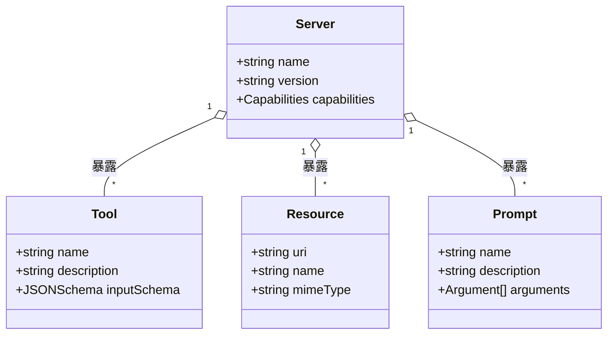
```mermaid
classDiagram
    class Server {
        +string name
        +string version
        +Capabilities capabilities
    }
    class Tool {
        +string name
        +string description
        +JSONSchema inputSchema
    }
    class Resource {
        +string uri
        +string name
        +string mimeType
    }
    class Prompt {
        +string name
        +string description
        +Argument[] arguments
    }
    Server "1" o-- "*" Tool : 暴露
    Server "1" o-- "*" Resource : 暴露
    Server "1" o-- "*" Prompt : 暴露
```

## 3.2 三类原语的核心 JSON-RPC 方法

围绕每类原语，协议定义了「发现（list）」与「使用（read / call / get）」两类方法：

| 原语 | 发现方法 | 使用方法 | 说明 |
|-|-|-|-|
| **Tools** | `tools/list` | `tools/call` | 列出可用工具；按名称与参数调用某工具并取回结果 |
| **Resources** | `resources/list`  <br/>`resources/templates/list` | `resources/read` | 列出资源 / 资源模板；按 URI 读取资源内容 |
| **Prompts** | `prompts/list` | `prompts/get` | 列出提示词模板；按名称 + 参数取回渲染后的消息 |

> **动态发现是关键设计：**Client 无需硬编码 Server 有哪些能力，而是在运行时调 `*/list` 动态获取。Server 能力变化时，还可通过 `notifications/*/list_changed` 通知主动告知 Client 刷新——这让整个系统**可插拔、可热更新**。


## 3.3 消息类型：JSON-RPC 2.0 三种基本形态

MCP 全部通信都是 JSON-RPC 2.0 消息，共三种形态：

| 消息类型 | 特征 | 典型用途 |
|-|-|-|
| **Request（请求）** | 含 `id`、`method`、`params`，**期望响应** | `initialize`、`tools/call`、`resources/read` |
| **Response（响应）** | 含相同 `id`，携带 `result` 或 `error` | 上述请求的返回结果 |
| **Notification（通知）** | 含 `method`，**无 `id`、不期望响应** | `notifications/initialized`、`.../list_changed`、进度通知 |

一个 `tools/call` 请求与响应的结构示意如下：

```json
// Request：调用名为 get_weather 的工具
{
  "jsonrpc": "2.0",
  "id": 1,
  "method": "tools/call",
  "params": {
    "name": "get_weather",
    "arguments": { "city": "Beijing" }
  }
}

// Response：返回结构化结果
{
  "jsonrpc": "2.0",
  "id": 1,
  "result": {
    "content": [
      { "type": "text", "text": "北京：晴，26℃" }
    ],
    "isError": false
  }
}
```

## 3.4 连接生命周期：三阶段状态机

一次 MCP 会话遵循清晰的三阶段生命周期——**初始化 → 运行 → 关闭**。初始化阶段完成协议版本协商与能力交换后，会话才进入可正常收发业务消息的运行态。

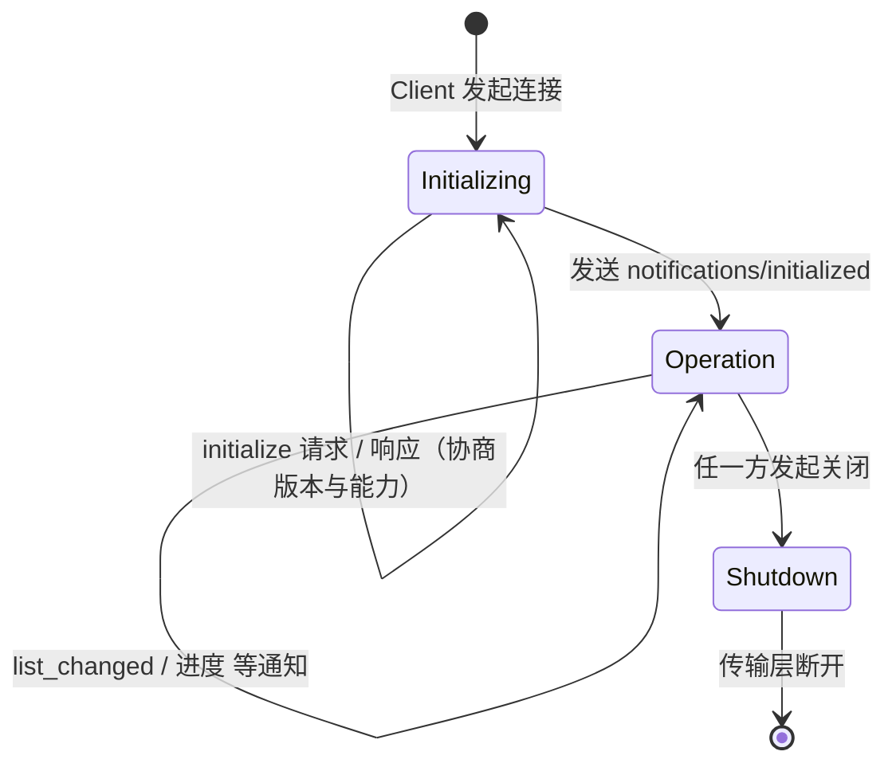
```mermaid
stateDiagram-v2
    [*] --> Initializing: Client 发起连接
    Initializing --> Initializing: initialize 请求 / 响应（协商版本与能力）
    Initializing --> Operation: 发送 notifications/initialized
    Operation --> Operation: tools·resources·prompts 收发
    Operation --> Operation: list_changed / 进度 等通知
    Operation --> Shutdown: 任一方发起关闭
    Shutdown --> [*]: 传输层断开
```

| 阶段 | 发生的事 | 关键消息 |
|-|-|-|
| **Initialization（初始化）** | Client 发 `initialize`（带协议版本 + 自身 capabilities），Server 回自身 capabilities；Client 再发 `initialized` 通知确认 | `initialize` / `notifications/initialized` |
| **Operation（运行）** | 正常收发：能力发现、工具调用、资源读取、提示词获取、各类通知 | `tools/*`、`resources/*`、`prompts/*` |
| **Shutdown（关闭）** | 任一方结束会话，底层传输断开（stdio 关闭输入流 / HTTP 断开） | 无专用消息，靠传输层关闭 |

## 3.5 能力协商（Capability Negotiation）

初始化时双方交换 `capabilities`，声明各自支持哪些特性——这保证了**协议的向前 / 向后兼容**：只有双方都声明支持的能力，才会在会话中启用。

| 声明方 | 常见能力字段 | 含义 |
|-|-|-|
| **Server** | `tools` / `resources` / `prompts` | 声明提供哪几类原语，及是否支持 `listChanged` 通知 |
| **Server** | `logging` / `completions` | 是否支持日志推送、参数自动补全 |
| **Client** | `roots` | 是否向 Server 暴露文件系统根目录 |
| **Client** | `sampling` | 是否允许 Server 反向请求 Client 侧 LLM 采样 |
| **Client** | `elicitation` | 是否支持 Server 在运行时向用户索取补充输入 |

> **双向能力：**MCP 不只是「Client 调 Server」的单向调用。通过 `sampling`，Server 可反过来请求 Client 帮它调用 LLM；通过 `elicitation`，Server 可在执行中让 Client 向用户追加提问。能力协商确保这些高级特性只在双方都支持时才启用。


## 3.6 完整交互流程（时序图）

下图展示一次典型会话的全过程：从初始化握手、能力发现，到工具调用与结果返回。

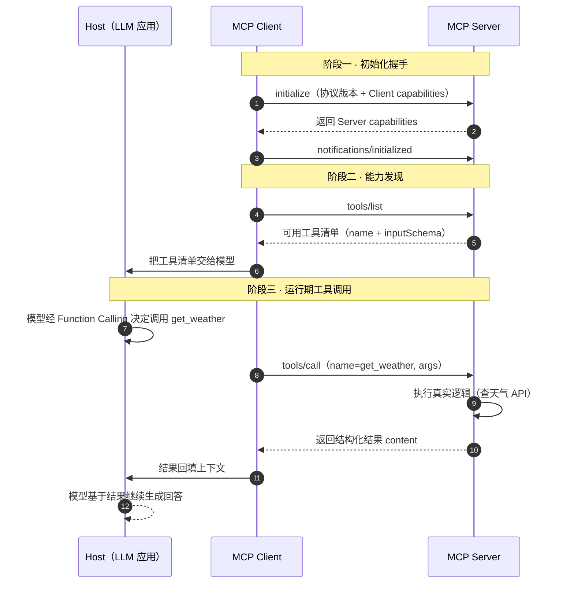
```mermaid
sequenceDiagram
    autonumber
    participant H as Host（LLM 应用）
    participant C as MCP Client
    participant S as MCP Server

    Note over C,S: 阶段一 · 初始化握手
    C->>S: initialize（协议版本 + Client capabilities）
    S-->>C: 返回 Server capabilities
    C->>S: notifications/initialized

    Note over C,S: 阶段二 · 能力发现
    C->>S: tools/list
    S-->>C: 可用工具清单（name + inputSchema）
    C->>H: 把工具清单交给模型

    Note over H,S: 阶段三 · 运行期工具调用
    H->>H: 模型经 Function Calling 决定调用 get_weather
    C->>S: tools/call（name=get_weather, args）
    S->>S: 执行真实逻辑（查天气 API）
    S-->>C: 返回结构化结果 content
    C->>H: 结果回填上下文
    H-->>H: 模型基于结果继续生成回答
```

---

# 四、MCP 协议分类

MCP 的「分类」通常从**传输层（Transport）**维度来看——协议语义（JSON-RPC 原语）保持不变，但底层如何传递消息有多种绑定。选对传输方式，直接决定 Server 是**本地进程**还是**远程服务**。

## 4.1 传输方式总览

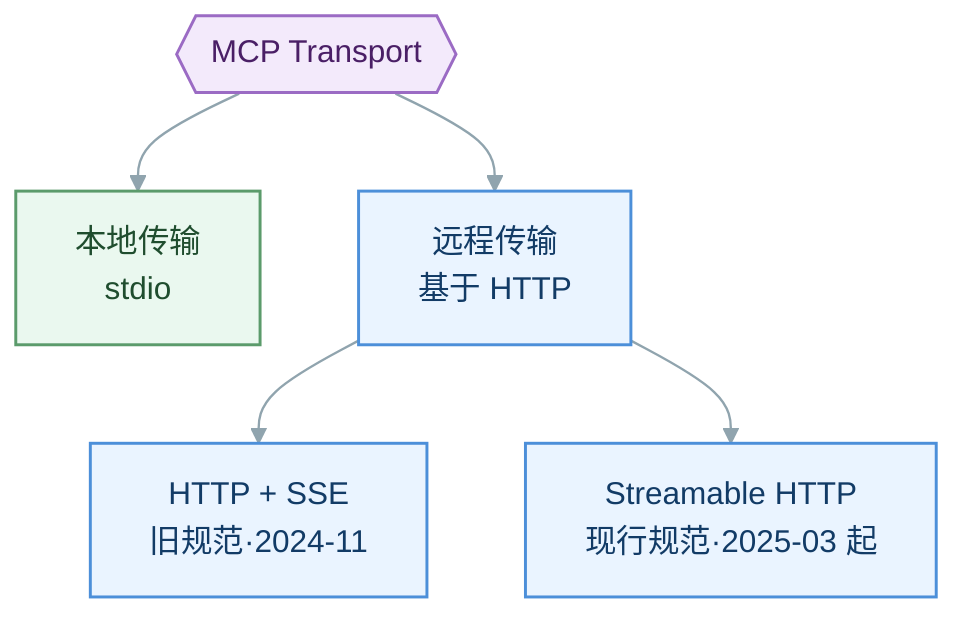
```mermaid
flowchart TB
    classDef root fill:#F3EAFB,stroke:#9B6BC4,stroke-width:1.5px,color:#4A1F66
    classDef local fill:#EAF8EF,stroke:#5B9B6B,stroke-width:1.5px,color:#1F4D2E
    classDef remote fill:#EAF4FF,stroke:#4C8FD9,stroke-width:1.5px,color:#123B66
    linkStyle default stroke:#90A4AE,stroke-width:1.2px

    ROOT{{MCP Transport}}:::root
    ROOT --> L[本地传输
stdio]:::local
    ROOT --> R[远程传输
基于 HTTP]:::remote
    R --> R1[HTTP + SSE
旧规范·2024-11]:::remote
    R --> R2[Streamable HTTP
现行规范·2025-03 起]:::remote
```

## 4.2 三种传输方式逐项对比

| 传输方式 | 部署形态 | 通信机制 | 适用场景 | 现状 |
|-|-|-|-|-|
| **stdio** | Server 作为本地子进程，与 Host 同机 | 通过标准输入 / 输出（stdin/stdout）读写 JSON-RPC 消息 | 本地工具：读写本地文件、操作本地数据库 / Git、访问本机命令 | 主流、最简单 |
| **HTTP + SSE** | Server 为远程服务 | 客户端 POST 发请求 + 单独的 SSE 长连接接收服务端推送（**双端点**） | 早期远程 Server | **已被取代**（旧规范） |
| **Streamable HTTP** | Server 为远程服务 | **单端点**`/mcp`：POST 发消息，响应可为一次性 JSON 或升级为 SSE 流；支持无状态部署与会话恢复 | 云端 / 多用户 / 需水平扩展的远程 Server | **现行推荐** |

> **演进要点：**2024 年最初规范用「HTTP + SSE 双端点」做远程传输，但它要求维持长连接、难以水平扩展。2025-03 起的规范用 **Streamable HTTP** 单端点取代：普通请求走一次性 HTTP 响应，需要流式 / 服务端推送时再按需升级为 SSE，从而兼顾**无状态可扩展**与**流式能力**。新项目应优先选 Streamable HTTP。


为了更直观地看出三种传输方式在**调用全生命周期**上的差异，下面分别用时序图刻画「连接建立 → 初始化握手 → 能力发现 → 工具调用 → 关闭」的完整链路。对照三张图即可看出：**stdio** 靠本地进程管道、无网络与会话概念；**HTTP + SSE** 需**双端点**且必须维持一条长连接；**Streamable HTTP** 收敛为**单端点**，响应可一次性返回或按需升级为流。

### **① stdio —— 本地子进程 · stdin/stdout 双工管道**

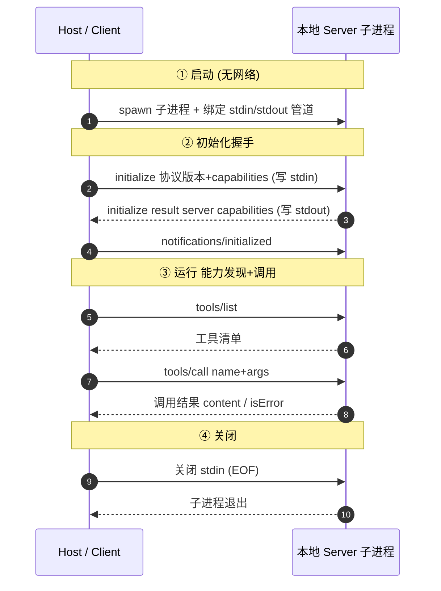
```mermaid
sequenceDiagram
    autonumber
    participant H as Host / Client
    participant S as 本地 Server 子进程
    Note over H,S: ① 启动 (无网络)
    H->>S: spawn 子进程 + 绑定 stdin/stdout 管道
    Note over H,S: ② 初始化握手
    H->>S: initialize 协议版本+capabilities (写 stdin)
    S-->>H: initialize result server capabilities (写 stdout)
    H->>S: notifications/initialized
    Note over H,S: ③ 运行 能力发现+调用
    H->>S: tools/list
    S-->>H: 工具清单
    H->>S: tools/call name+args
    S-->>H: 调用结果 content / isError
    Note over H,S: ④ 关闭
    H->>S: 关闭 stdin (EOF)
    S-->>H: 子进程退出
```

### **② HTTP + SSE（旧规范，双端点：GET /sse 收 + POST /messages 发）**

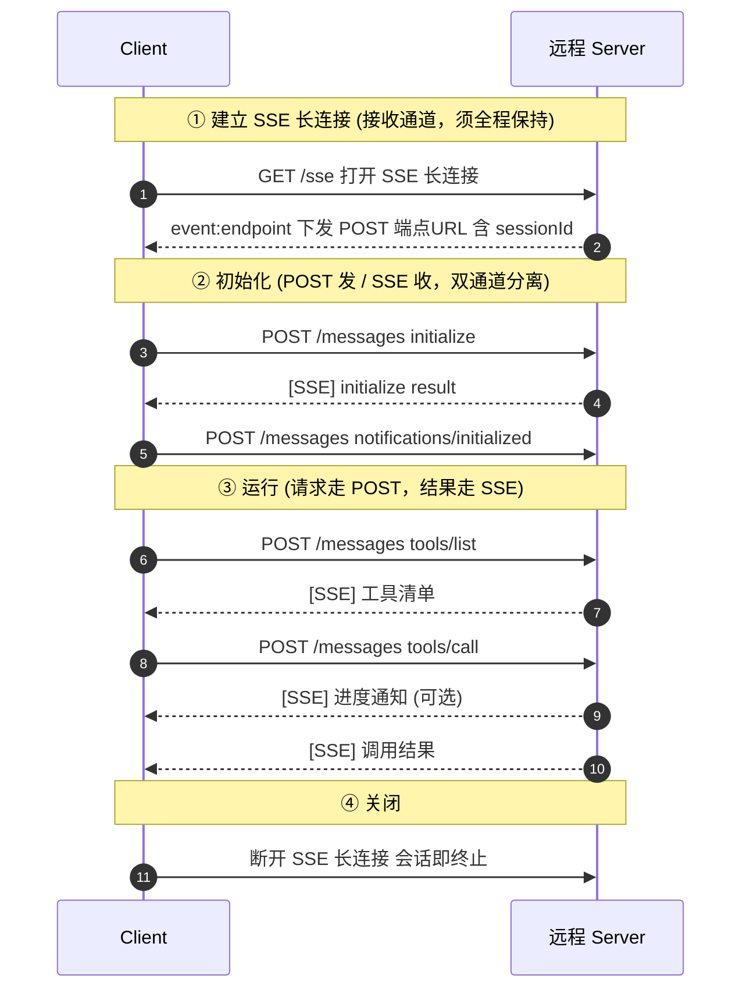
```mermaid
sequenceDiagram
    autonumber
    participant C as Client
    participant S as 远程 Server
    Note over C,S: ① 建立 SSE 长连接 (接收通道，须全程保持)
    C->>S: GET /sse 打开 SSE 长连接
    S-->>C: event:endpoint 下发 POST 端点URL 含 sessionId
    Note over C,S: ② 初始化 (POST 发 / SSE 收，双通道分离)
    C->>S: POST /messages initialize
    S-->>C: [SSE] initialize result
    C->>S: POST /messages notifications/initialized
    Note over C,S: ③ 运行 (请求走 POST，结果走 SSE)
    C->>S: POST /messages tools/list
    S-->>C: [SSE] 工具清单
    C->>S: POST /messages tools/call
    S-->>C: [SSE] 进度通知 (可选)
    S-->>C: [SSE] 调用结果
    Note over C,S: ④ 关闭
    C->>S: 断开 SSE 长连接 会话即终止
```

### **③ Streamable HTTP（现行规范 2025-03，单端点 /mcp · 会话头 Mcp-Session-Id）**

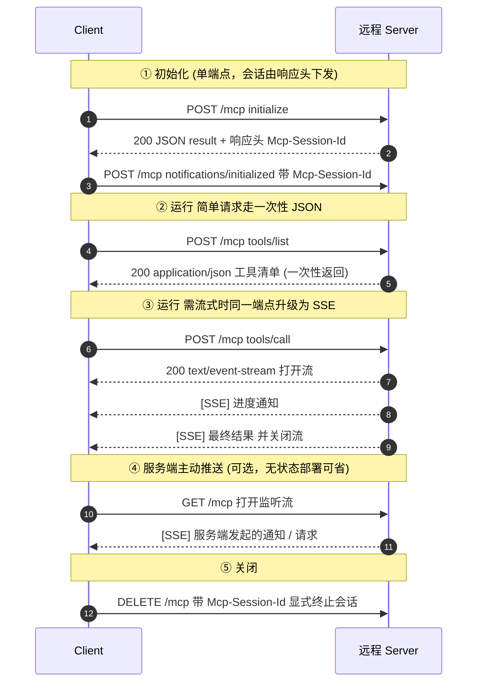
```mermaid
sequenceDiagram
    autonumber
    participant C as Client
    participant S as 远程 Server
    Note over C,S: ① 初始化 (单端点，会话由响应头下发)
    C->>S: POST /mcp initialize
    S-->>C: 200 JSON result + 响应头 Mcp-Session-Id
    C->>S: POST /mcp notifications/initialized 带 Mcp-Session-Id
    Note over C,S: ② 运行 简单请求走一次性 JSON
    C->>S: POST /mcp tools/list
    S-->>C: 200 application/json 工具清单 (一次性返回)
    Note over C,S: ③ 运行 需流式时同一端点升级为 SSE
    C->>S: POST /mcp tools/call
    S-->>C: 200 text/event-stream 打开流
    S-->>C: [SSE] 进度通知
    S-->>C: [SSE] 最终结果 并关闭流
    Note over C,S: ④ 服务端主动推送 (可选，无状态部署可省)
    C->>S: GET /mcp 打开监听流
    S-->>C: [SSE] 服务端发起的通知 / 请求
    Note over C,S: ⑤ 关闭
    C->>S: DELETE /mcp 带 Mcp-Session-Id 显式终止会话
```

> **三图对照的关键差异：①连接载体**——stdio 是本地进程管道（无网络、无鉴权、无 session），后两者是网络连接；**②端点数量**——HTTP+SSE 需 `GET /sse` 与 `POST /messages` **两个端点**且长连接须全程保持，Streamable HTTP 收敛为 `/mcp` **单端点**；**③会话管理**——stdio 靠进程存活、HTTP+SSE 靠 SSE 连接内的 `sessionId`、Streamable HTTP 靠响应头 `Mcp-Session-Id`（可无状态）；**④响应形态**——Streamable HTTP 可「一次性 JSON」或「按需升级 SSE 流」二选一，而旧 SSE 方案所有响应都必须经由那条常驻长连接回传，这正是它难以水平扩展、被取代的根因。


## 4.3 本地 stdio vs 远程 HTTP：如何选型

| 决策维度 | stdio（本地） | Streamable HTTP（远程） |
|-|-|-|
| **Server 位置** | 与 Host 同一台机器，随 Host 启停 | 独立部署，可在任意主机 / 云上 |
| **多用户共享** | 否，每个 Host 各自拉起进程 | 是，可服务多个远端 Client |
| **鉴权需求** | 一般无需（本地信任） | 需要 OAuth / API Key 等鉴权 |
| **典型能力** | 文件系统、Git、本地脚本、本地数据库 | SaaS API、企业内部服务、团队共享工具 |
| **扩展性** | 受单机资源限制 | 可水平扩容、负载均衡 |

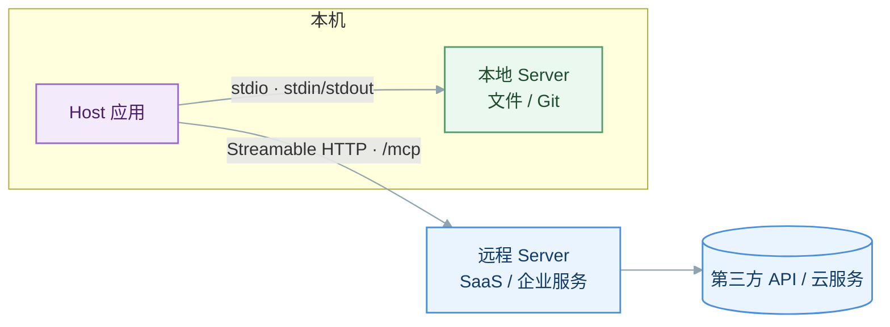
```mermaid
flowchart LR
    classDef host fill:#F3EAFB,stroke:#9B6BC4,stroke-width:1.5px,color:#4A1F66
    classDef local fill:#EAF8EF,stroke:#5B9B6B,stroke-width:1.5px,color:#1F4D2E
    classDef remote fill:#EAF4FF,stroke:#4C8FD9,stroke-width:1.5px,color:#123B66
    linkStyle default stroke:#90A4AE,stroke-width:1.2px

    subgraph M[本机]
        HOST[Host 应用]:::host
        HOST -->|stdio · stdin/stdout| LS[本地 Server
文件 / Git]:::local
    end
    HOST -->|Streamable HTTP · /mcp| RS[远程 Server
SaaS / 企业服务]:::remote
    RS --> API[(第三方 API / 云服务)]:::remote
```

## 4.4 多实例 MCP Server：会话如何路由到同一实例

当远程 Server 以**多实例**方式部署（负载均衡 + 水平扩容）时，会遇到一个 stdio / 单实例场景下不存在的问题：**同一会话的多次请求可能被负载均衡分发到不同实例**。由于会话状态（`Mcp-Session-Id` 对应的上下文）默认只存在于首次响应它的那个实例内存中，一旦后续请求打到别的实例，就会因「找不到会话」而返回 `HTTP 404`。本节说明该问题的成因，并给出两种主流解决思路与兜底机制。

### 4.4.1 问题背景：握手被打散导致 404

回顾 Streamable HTTP 的初始化握手，它由两步网络往返构成：① Client `POST /mcp` 发送 `initialize`，Server 在 **响应头** 下发 `Mcp-Session-Id`；② Client 携带该 `Mcp-Session-Id` 再发 `notifications/initialized` 及后续所有请求。问题在于：**会话 ID 是「有状态实例」在第①步创建并保存在自身内存里的**，若第②步及之后的请求被负载均衡分到另一个实例，新实例并不认识这个会话，只能返回 `404 Session not found`。

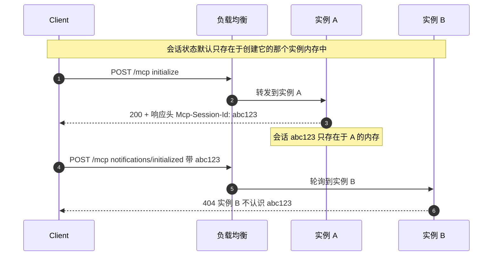
```mermaid
sequenceDiagram
    autonumber
    participant C as Client
    participant LB as 负载均衡
    participant S1 as 实例 A
    participant S2 as 实例 B
    Note over C,S2: 会话状态默认只存在于创建它的那个实例内存中
    C->>LB: POST /mcp initialize
    LB->>S1: 转发到实例 A
    S1-->>C: 200 + 响应头 Mcp-Session-Id: abc123
    Note over S1: 会话 abc123 只存在于 A 的内存
    C->>LB: POST /mcp notifications/initialized 带 abc123
    LB->>S2: 轮询到实例 B
    S2-->>C: 404 实例 B 不认识 abc123
```

### 4.4.2 解决思路一：粘性会话（Sticky Session）

在负载均衡 / Ingress 层开启**会话亲和（session affinity）**：把同一 `Mcp-Session-Id` 的所有请求固定路由到**首次创建该会话的实例**。Server 代码几乎无需改造，仅调整入口层配置即可。

**关键细节：**首次 `initialize` 请求还没有会话 ID，因此**第一跳无法按会话做亲和**，只能由负载均衡自由选一个实例；亲和只在 Server 下发 `Mcp-Session-Id` **之后**才对后续请求生效。因此亲和键要绑定到 `Mcp-Session-Id`（或据其派生的 Cookie），而非仅靠客户端 IP。

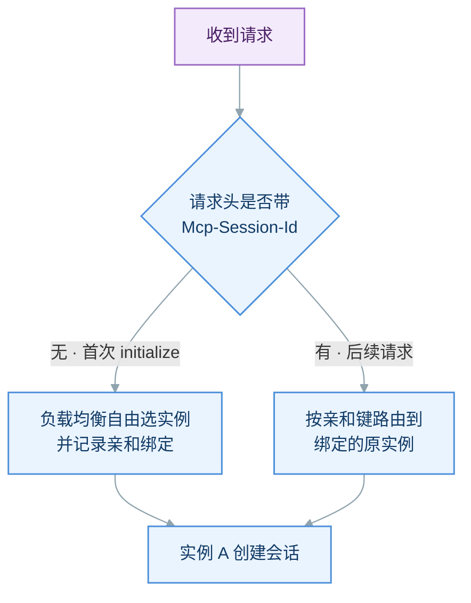
```mermaid
flowchart TD
    classDef entry fill:#F3EAFB,stroke:#9B6BC4,stroke-width:1.5px,color:#4A1F66
    classDef node fill:#EAF4FF,stroke:#4C8FD9,stroke-width:1.5px,color:#123B66
    linkStyle default stroke:#90A4AE,stroke-width:1.2px
    REQ[收到请求]:::entry --> Q{请求头是否带
Mcp-Session-Id}
    Q -->|无 · 首次 initialize| PICK[负载均衡自由选实例
并记录亲和绑定]:::node
    Q -->|有 · 后续请求| HIT[按亲和键路由到
绑定的原实例]:::node
    PICK --> A[实例 A 创建会话]:::node
    HIT --> A
```

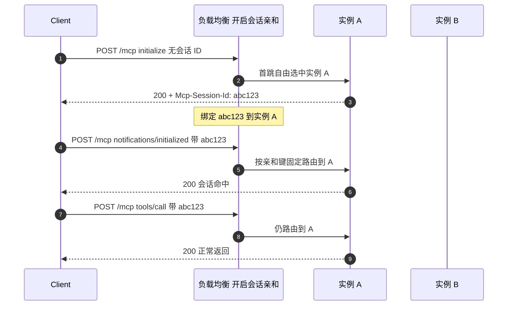
```mermaid
sequenceDiagram
    autonumber
    participant C as Client
    participant LB as 负载均衡 开启会话亲和
    participant S1 as 实例 A
    participant S2 as 实例 B
    C->>LB: POST /mcp initialize 无会话 ID
    LB->>S1: 首跳自由选中实例 A
    S1-->>C: 200 + Mcp-Session-Id: abc123
    Note over LB: 绑定 abc123 到实例 A
    C->>LB: POST /mcp notifications/initialized 带 abc123
    LB->>S1: 按亲和键固定路由到 A
    S1-->>C: 200 会话命中
    C->>LB: POST /mcp tools/call 带 abc123
    LB->>S1: 仍路由到 A
    S1-->>C: 200 正常返回
```

### 4.4.3 解决思路二：Server 无状态化 + 共享存储

另一条路是让 Server**不在本地内存保存会话状态**：要么以完全无状态模式运行（如 `stateless_http=True`，每个请求自带完成处理所需的全部信息），要么把会话上下文**外置到共享存储**（Redis / 数据库）。这样任意实例都能服务任意请求，负载均衡无需亲和，天然支持水平扩容与实例故障转移。

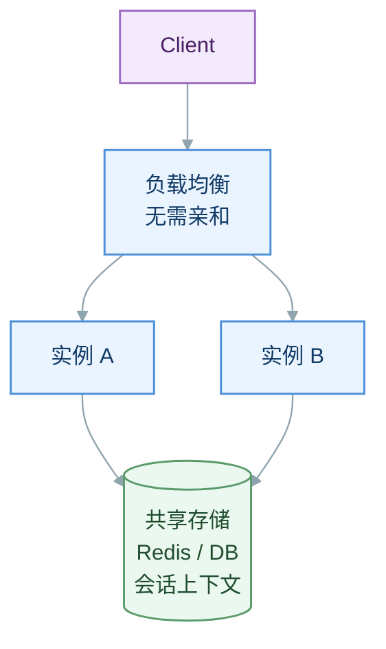
```mermaid
flowchart TD
    classDef entry fill:#F3EAFB,stroke:#9B6BC4,stroke-width:1.5px,color:#4A1F66
    classDef node fill:#EAF4FF,stroke:#4C8FD9,stroke-width:1.5px,color:#123B66
    classDef store fill:#EAF8EF,stroke:#5B9B6B,stroke-width:1.5px,color:#1F4D2E
    linkStyle default stroke:#90A4AE,stroke-width:1.2px
    C[Client]:::entry --> LB[负载均衡
无需亲和]:::node
    LB --> A[实例 A]:::node
    LB --> B[实例 B]:::node
    A --> R[(共享存储
Redis / DB
会话上下文)]:::store
    B --> R
```

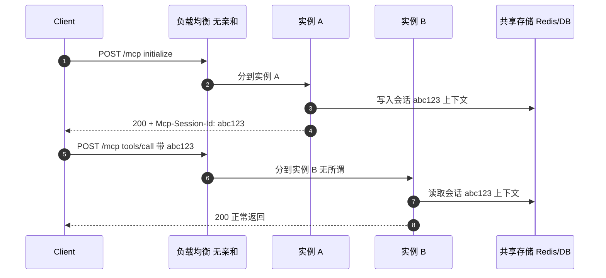
```mermaid
sequenceDiagram
    autonumber
    participant C as Client
    participant LB as 负载均衡 无亲和
    participant S1 as 实例 A
    participant S2 as 实例 B
    participant R as 共享存储 Redis/DB
    C->>LB: POST /mcp initialize
    LB->>S1: 分到实例 A
    S1->>R: 写入会话 abc123 上下文
    S1-->>C: 200 + Mcp-Session-Id: abc123
    C->>LB: POST /mcp tools/call 带 abc123
    LB->>S2: 分到实例 B 无所谓
    S2->>R: 读取会话 abc123 上下文
    S2-->>C: 200 正常返回
```

**实战:mcp-go 的三种会话管理器。**以 `github.com/mark3labs/mcp-go` 为例,其 `StreamableHTTPServer` 通过 `SessionIdManager` 决定会话行为,内置三种实现,直接决定了「能否让请求自由落到任意实例」:

| 管理器 | 启用方式 | 会话行为 | 多实例影响 |
|-|-|-|-|
| `StatelessSessionIdManager` | `WithStateLess(true)` | 不管理任何会话:每个请求都视为全新会话,既不下发也不校验 session id | 真正无状态,任意实例都能服务任意请求;但服务端不保留任何跨请求上下文 |
| `StatelessGeneratingSessionIdManager` | 默认(未显式配置) | 会生成并下发 session id,但 `Validate` 恒为通过、不做本地校验 | 换实例也不会 404,但服务端同样不在本地保存会话上下文 |
| `InsecureStatefulSessionIdManager` | `WithStateful()` | 会话存于本地内存并校验,未知 session id 直接拒绝 | 必须配合粘性会话,否则跨实例请求返回 `404` |

> **「会话信息存在哪里」的答案:**在无状态模式下,mcp-go **不提供会话存储的插件接口**。每次请求由 `newStreamableHttpSession(...)` 创建的是**临时会话对象,生命周期等于单次请求**;会话级数据仅放在进程内的 `sync.Map`(进程内存,既不持久化也不跨实例)。因此默认**不存**任何跨请求状态——若业务需要跨请求或跨实例的会话上下文,必须**由业务方自行接入外部存储**(如 Redis / DB),并让每个请求自包含地读写它[[streamable_http.go]](https://github.com/mark3labs/mcp-go/blob/main/server/streamable_http.go)。


### 4.4.4 兜底机制与方案对比

**兜底：404 自愈重连。**协议层面已内置一道保险——当 Client 收到 `HTTP 404` 时，应视为会话失效，**丢弃旧的 `Mcp-Session-Id` 并重新发起 `initialize` 握手**获取新会话。即便亲和偶发失效或实例被回收，客户端也能自动恢复，只是会损失该会话的中间上下文。

| 对比维度 | 粘性会话（思路一） | 无状态 + 共享存储（思路二） |
|-|-|-|
| **改造位置** | 仅负载均衡 / Ingress 配置 | Server 代码 + 引入共享存储 |
| **Server 状态** | 有状态，会话留在实例内存 | 无状态 / 状态外置到 Redis / DB |
| **水平扩展** | 受亲和约束，扩缩容时会话易断 | 天然支持，任意实例可服务任意请求 |
| **故障影响** | 实例宕机则其上会话全部丢失 | 实例宕机可无缝转移，会话不丢 |
| **额外开销** | 几乎为零 | 共享存储的读写延迟与运维成本 |
| **适用场景** | 快速上线、改造成本敏感 | 高可用、大规模、需弹性伸缩 |

> **选型建议：**追求最小改造、快速让多实例可用 → 优先**粘性会话**；对高可用与弹性伸缩有要求、且愿意承担共享存储成本 → 选**无状态化**。无论哪种，都应实现 `404 → 重新 initialize` 的兜底，让客户端具备自愈能力。


---

# 五、MCP Client：发起连接与调用的一方

Client 是运行在 **Host 内部**、与**某一个 Server 一一对应**的连接器。一个 Host 里有几个 Server，就有几个 Client 实例。它是「模型意图」与「Server 能力」之间的翻译官与传输管道。

## 5.1 Client 的核心职责

| 职责 | 做什么 | 对应方法 / 机制 |
|-|-|-|
| **建立连接** | 与 Server 完成初始化握手、协商协议版本与能力 | `initialize` / `notifications/initialized` |
| **能力发现** | 动态列举 Server 的工具 / 资源 / 提示词 | `tools/list`、`resources/list`、`prompts/list` |
| **调用与读取** | 把模型的调用意图转成 JSON-RPC 请求并转发 | `tools/call`、`resources/read`、`prompts/get` |
| **消息路由** | 收发 Request / Response / Notification，匹配 `id`，分发通知 | JSON-RPC 消息循环 |
| **响应 Server 回调** | 处理 Server 反向发起的 `sampling` / `elicitation` 请求 | 需 Client 声明对应 capability |

## 5.2 Client 在 Host 中的位置

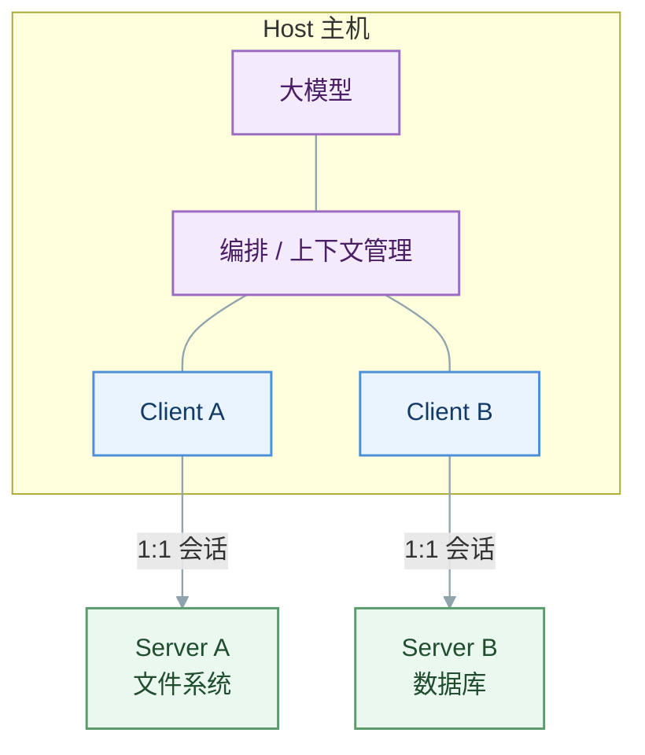
```mermaid
flowchart TB
    classDef host fill:#F3EAFB,stroke:#9B6BC4,stroke-width:1.5px,color:#4A1F66
    classDef client fill:#EAF4FF,stroke:#4C8FD9,stroke-width:1.5px,color:#123B66
    classDef server fill:#EAF8EF,stroke:#5B9B6B,stroke-width:1.5px,color:#1F4D2E
    linkStyle default stroke:#90A4AE,stroke-width:1.2px

    subgraph HOST[Host 主机]
        LLM[大模型]:::host
        ORCH[编排 / 上下文管理]:::host
        CA[Client A]:::client
        CB[Client B]:::client
        LLM --- ORCH
        ORCH --- CA
        ORCH --- CB
    end
    CA -->|1:1 会话| SA[Server A
文件系统]:::server
    CB -->|1:1 会话| SB[Server B
数据库]:::server
```

> **1:1 原则：**每个 Client 只维护与单个 Server 的连接，互不干扰。Host 通过持有多个 Client 来聚合多个 Server 的能力，并统一做上下文注入、权限审批与结果汇总。这种设计让「连接管理」与「模型编排」职责清晰分离。


## 5.3 常见的 MCP Host / Client 实现

| Host 应用 | 说明 |
|-|-|
| **Claude Desktop / Claude Code** | Anthropic 官方客户端，MCP 的首发落地场景 |
| **IDE 插件（Cursor、Cline、Continue 等）** | 在编辑器内接入本地 / 远程 Server，赋能编码 Agent |
| **自建 Agent 框架** | 通过官方 SDK（Python / TypeScript / Java 等）内嵌 MCP Client |

---

# 六、MCP Server：提供能力的一方

Server 是**独立的能力提供方**——把真实的工具、数据、服务封装成标准的 Tools / Resources / Prompts 对外暴露。它可以是与 Host 同机的本地进程（stdio），也可以是远程 HTTP 服务。

## 6.1 Server 的核心职责

| 职责 | 做什么 |
|-|-|
| **声明能力** | 初始化时向 Client 声明自身 capabilities（提供哪几类原语） |
| **响应发现** | 处理 `tools/list` / `resources/list` / `prompts/list`，返回能力清单 |
| **执行调用** | 处理 `tools/call`：执行真实业务逻辑并返回结构化结果 |
| **提供数据** | 处理 `resources/read`：按 URI 返回资源内容供上下文注入 |
| **主动通知** | 能力变化时发 `list_changed`；长任务发进度通知 |

## 6.2 Server 内部处理架构

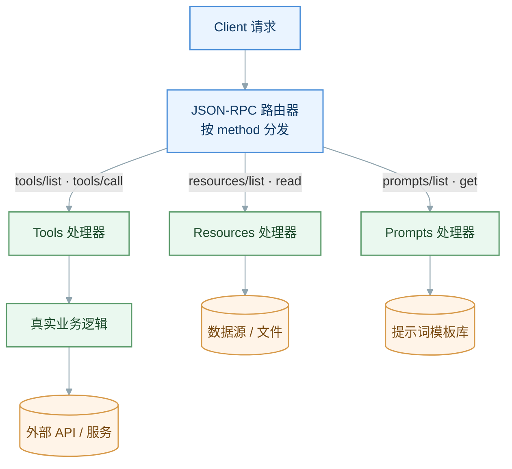
```mermaid
flowchart TB
    classDef entry fill:#EAF4FF,stroke:#4C8FD9,stroke-width:1.5px,color:#123B66
    classDef core fill:#EAF8EF,stroke:#5B9B6B,stroke-width:1.5px,color:#1F4D2E
    classDef res fill:#FFF4E8,stroke:#D79A4A,stroke-width:1.5px,color:#7A4B12
    linkStyle default stroke:#90A4AE,stroke-width:1.2px

    REQ[Client 请求]:::entry --> RT[JSON-RPC 路由器
按 method 分发]:::entry
    RT -->|tools/list · tools/call| TH[Tools 处理器]:::core
    RT -->|resources/list · read| RH[Resources 处理器]:::core
    RT -->|prompts/list · get| PH[Prompts 处理器]:::core
    TH --> BIZ[真实业务逻辑]:::core
    RH --> DATA[(数据源 / 文件)]:::res
    PH --> TPL[(提示词模板库)]:::res
    BIZ --> EXT[(外部 API / 服务)]:::res
```

## 6.3 一个最小 Server 的定义示意

以官方 Python SDK（FastMCP 风格）声明一个天气工具为例，开发者只需用装饰器注册函数，SDK 自动生成 `inputSchema` 并处理协议细节：

```python
from mcp.server.fastmcp import FastMCP

mcp = FastMCP("weather-server")

@mcp.tool()
def get_weather(city: str) -> str:
    """查询指定城市的当前天气"""
    # 真实实现里会调用天气 API
    return f"{city}：晴，26℃"

if __name__ == "__main__":
    mcp.run(transport="stdio")   # 本地 stdio；远程可换 streamable-http
```

> **开发心智模型：**写 MCP Server 的核心，就是「把已有的函数 / API 声明成 Tool，把已有的数据源声明成 Resource」。协议握手、能力发现、消息编解码、传输层等都由 SDK 封装，开发者只聚焦**业务能力本身**。


## 6.4 Server 端安全与最佳实践

| 维度 | 实践建议 |
|-|-|
| **最小权限** | Server 只暴露必要的 Tools / Resources，避免过度授权 |
| **输入校验** | 对 `tools/call` 的参数按 `inputSchema` 严格校验，防注入 |
| **用户审批** | 有副作用的工具调用交由 Host 侧提示用户确认（人在环中） |
| **鉴权（远程）** | 远程 HTTP Server 应接入 OAuth 2.1 / API Key 等鉴权 |
| **错误处理** | 用 JSON-RPC 标准错误码返回，`isError` 标记工具执行失败 |

> **小结：**MCP 用「Host-Client-Server」三方架构 + 「Tools/Resources/Prompts」三类原语 + JSON-RPC 2.0 通信，把 AI 应用连接外部世界的方式标准化。它与 Function Calling 分工协作——模型负责「想调什么」，MCP 负责「怎么标准化地接入与执行」，共同构成现代 Agent 系统连接工具与数据的基础设施。


# 七、MCP 实践

> Demo 仓库地址：https://github.com/lugezuishuai/mcp_demo


## 项目架构解析

本章以开源项目 [lugezuishuai/mcp_demo](https://github.com/lugezuishuai/mcp_demo) 为例，落地讲解 MCP 三方角色的真实实现。该项目用一套工具（`web_search` / `web_fetch`）同时暴露 **Stdio、HTTP+SSE、Streamable HTTP** 三种传输入口，Host 端由 LangGraph 承载 ReAct 循环，MCP Client 在运行时动态发现工具，是观察「Host—Client—Server」协作与三种 transport 差异的理想样本。

### 7.1 项目整体架构

> Host 不硬编码工具 schema：MCP Client 在启动时完成 `initialize + tools/list`，把动态发现的工具转成 LangChain 工具再绑定给模型;传输方式可在 Stdio / SSE / Streamable HTTP 之间切换，工具行为保持一致。

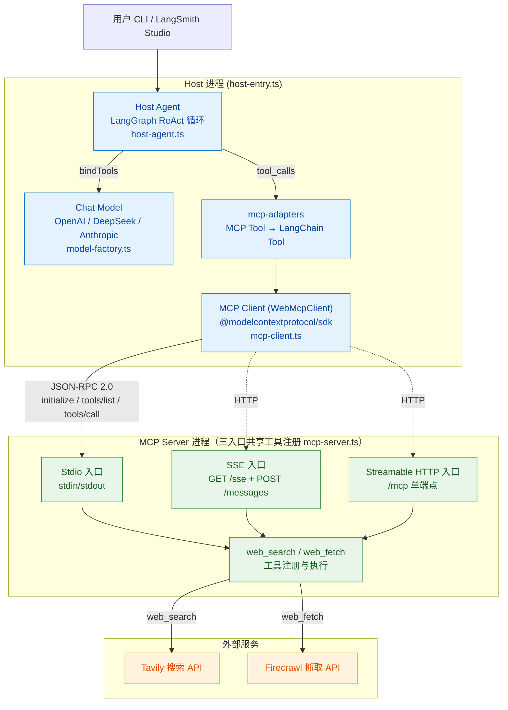
```mermaid
flowchart TB
  User["用户 CLI / LangSmith Studio"]

  subgraph HostProc["Host 进程 (host-entry.ts)"]
    direction TB
    Agent["Host Agent
LangGraph ReAct 循环
host-agent.ts"]
    Model["Chat Model
OpenAI / DeepSeek / Anthropic
model-factory.ts"]
    Client["MCP Client (WebMcpClient)
@modelcontextprotocol/sdk
mcp-client.ts"]
    Adapter["mcp-adapters
MCP Tool → LangChain Tool"]
    Agent -->|bindTools| Model
    Agent -->|tool_calls| Adapter
    Adapter --> Client
  end

  subgraph ServerProc["MCP Server 进程（三入口共享工具注册 mcp-server.ts）"]
    direction TB
    Stdio["Stdio 入口
stdin/stdout"]
    SSE["SSE 入口
GET /sse + POST /messages"]
    SHTTP["Streamable HTTP 入口
/mcp 单端点"]
    Reg["web_search / web_fetch
工具注册与执行"]
    Stdio --> Reg
    SSE --> Reg
    SHTTP --> Reg
  end

  subgraph Ext["外部服务"]
    Tavily["Tavily 搜索 API"]
    Firecrawl["Firecrawl 抓取 API"]
  end

  User --> Agent
  Client -->|"JSON-RPC 2.0
initialize / tools/list / tools/call"| Stdio
  Client -.->|HTTP| SSE
  Client -.->|HTTP| SHTTP
  Reg -->|web_search| Tavily
  Reg -->|web_fetch| Firecrawl

  classDef host fill:#E3F2FD,stroke:#1976D2,color:#0D47A1
  classDef server fill:#E8F5E9,stroke:#388E3C,color:#1B5E20
  classDef ext fill:#FFF3E0,stroke:#F57C00,color:#E65100
  class Agent,Model,Client,Adapter host
  class Stdio,SSE,SHTTP,Reg server
  class Tavily,Firecrawl ext
```

### 7.2 关键代码模块与职责映射

| 模块文件 | 所属角色 | 核心职责 |
|-|-|-|
| `host-entry.ts` | Host | CLI 入口:解析参数、装配配置、单轮/多轮交互,退出时关闭 Client |
| `host-arguments.ts` | Host | 解析 `--transport`（stdio / sse / streamable-http）与 prompt |
| `host-agent.ts` | Host | `HostAgent` 生命周期 + LangGraph ReAct 图（model → tools → model） |
| `model-factory.ts` | Host | 按 provider 创建 ChatOpenAI / ChatAnthropic,统一超时与重试 |
| `mcp-client.ts` | MCP Client | 按连接参数选 transport;`loadTools()` 执行握手与 `tools/list` |
| `mcp-server.ts` | MCP Server | 注册 `web_search` / `web_fetch`,定义 input/output schema 与 annotations |
| `mcp-http-server.ts` | MCP Server | SSE 与 Streamable HTTP 的会话管理、生命周期与健康检查 |
| `mcp-server-stdio-entry.ts` | MCP Server | Stdio 入口:stdout 仅传 JSON-RPC,日志走 stderr |
| `mcp-server-sse-entry.ts` | MCP Server | SSE 入口:监听 `MCP_SSE_PORT`（默认 3001） |
| `mcp-server-streamable-http-entry.ts` | MCP Server | Streamable HTTP 入口:监听 `MCP_STREAMABLE_HTTP_PORT`（默认 3002） |
| `web-tools.ts` | MCP Server | Tavily / Firecrawl 业务适配,裁剪字段并做内容截断 |
| `config.ts` | 公共 | 环境变量解析校验（zod）,凭据只从 env 读取 |

### 7.3 三种 Transport 对比与选型

| 维度 | Stdio | HTTP + SSE（弃用） | Streamable HTTP（推荐） |
|-|-|-|-|
| 部署形态 | Host 拉起本地子进程 | 独立网络进程 | 独立网络进程 |
| 端点 | stdin / stdout | `GET /sse` + `POST /messages` 双端点 | `/mcp` 单端点 |
| 会话标识 | 进程即会话 | 连接建立时下发 `sessionId` | `Mcp-Session-Id` 响应头 |
| Client transport | `StdioClientTransport` | `SSEClientTransport` | `StreamableHTTPClientTransport` |
| 凭据位置 | Host 进程需持有工具 Key | 独立 Server 持有,Host 只需模型 Key | 同 SSE |
| 适用场景 | 本地开发、单机集成 | 兼容旧客户端 | 现行远程接入首选 |

> 选型规则:本地/单机默认 Stdio;需要跨进程或远程访问时用 Streamable HTTP;SSE 仅用于兼容旧客户端。三入口共享同一套工具注册,不因传输方式产生工具行为差异。

### 7.4 一次完整的 MCP 交互流程

无论使用哪种 transport,一次请求都经历统一的四阶段:**连接握手 → 能力发现 → 模型决策 → 工具调用**。下图是三种传输共用的高层流程。

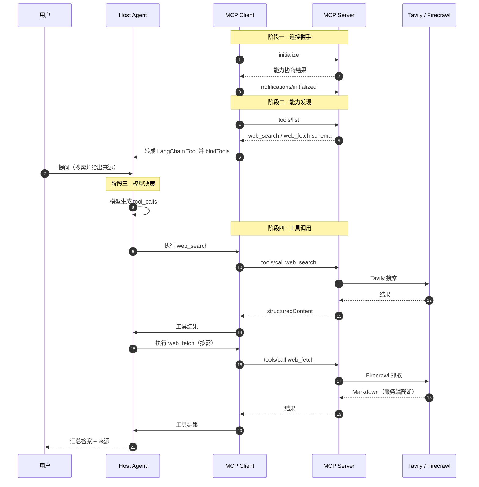
```mermaid
sequenceDiagram
  autonumber
  participant U as 用户
  participant A as Host Agent
  participant C as MCP Client
  participant S as MCP Server
  participant W as Tavily / Firecrawl

  Note over C,S: 阶段一 · 连接握手
  C->>S: initialize
  S-->>C: 能力协商结果
  C->>S: notifications/initialized

  Note over C,S: 阶段二 · 能力发现
  C->>S: tools/list
  S-->>C: web_search / web_fetch schema
  C->>A: 转成 LangChain Tool 并 bindTools

  U->>A: 提问（搜索并给出来源）
  Note over A: 阶段三 · 模型决策
  A->>A: 模型生成 tool_calls

  Note over C,S: 阶段四 · 工具调用
  A->>C: 执行 web_search
  C->>S: tools/call web_search
  S->>W: Tavily 搜索
  W-->>S: 结果
  S-->>C: structuredContent
  C->>A: 工具结果

  A->>C: 执行 web_fetch（按需）
  C->>S: tools/call web_fetch
  S->>W: Firecrawl 抓取
  W-->>S: Markdown（服务端截断）
  S-->>C: 结果
  C->>A: 工具结果
  A-->>U: 汇总答案 + 来源
```

三种 transport 的差异集中在**连接建立**与**消息通道**环节,以下分别展开。

#### 7.4.1 Stdio:Host 拉起本地子进程

```mermaid
sequenceDiagram
  autonumber
  participant A as Host Agent
  participant C as MCP Client
  participant P as Server 子进程

  A->>C: HostAgent.create（transport=stdio）
  C->>P: spawn（tsx 运行 stdio-entry）
  Note over C,P: stdout 仅传 JSON-RPC,日志走 stderr
  C->>P: initialize（stdin）
  P-->>C: 结果（stdout）
  C->>P: notifications/initialized
  C->>P: tools/list
  P-->>C: 工具 schema
  Note over A,P: 后续 tools/call 均经 stdin/stdout
  A->>C: close()
  C->>P: 关闭 transport 并终止子进程
```

#### 7.4.2 HTTP + SSE:双端点（弃用）

```mermaid
sequenceDiagram
  autonumber
  participant C as MCP Client
  participant S as SSE Server 3001

  C->>S: GET /sse 建立下行流
  S-->>C: endpoint 事件（sessionId + 上行地址）
  C->>S: POST /messages（initialize）
  S-->>C: 经 SSE 流下行返回结果
  C->>S: POST /messages（notifications/initialized）
  C->>S: POST /messages（tools/list）
  S-->>C: 经 SSE 流下行返回 schema
  Note over C,S: 请求走 POST,响应走 GET 长连接
```

#### 7.4.3 Streamable HTTP:单端点有状态会话（推荐）

```mermaid
sequenceDiagram
  autonumber
  participant C as MCP Client
  participant S as Streamable HTTP Server 3002

  C->>S: POST /mcp（initialize,无会话头）
  Note over S: 识别 initialize 新建 transport
  S-->>C: 响应头 Mcp-Session-Id
  C->>S: POST /mcp（initialized,带会话头）
  C->>S: POST /mcp（tools/list,带会话头）
  S-->>C: 工具 schema
  Note over C,S: POST/GET/DELETE 复用 /mcp 按会话路由
  C->>S: DELETE /mcp（结束会话,可选）
```

### 7.5 配置、运行与验证

| 环境变量 | 作用 | 默认值 |
|-|-|-|
| `MODEL_PROVIDER` / `MODEL` | 模型厂商与型号 | `openai` / `gpt-4o-mini` |
| `API_KEY` | 模型密钥（也支持厂商专属 Key） | 无 |
| `TAVILY_API_KEY` | `web_search` 凭据 | 无 |
| `FIRECRAWL_API_KEY` | `web_fetch` 凭据 | 无 |
| `MCP_HTTP_HOST` | HTTP Server 绑定地址 | `127.0.0.1` |
| `MCP_SSE_PORT` | SSE 监听端口 | `3001` |
| `MCP_STREAMABLE_HTTP_PORT` | Streamable HTTP 监听端口 | `3002` |
| `WEB_FETCH_MAX_CHARACTERS` | 抓取内容截断上限 | `20000` |

| 目的 | 命令 | 说明 |
|-|-|-|
| 无费用诊断 | `npm run doctor` | 完成握手 + `tools/list`,不调用模型与外部 API |
| Host（Stdio） | `npm run host:stdio -- "..."` | Host 自动拉起 Server 子进程 |
| Host（SSE） | `npm run host:sse -- "..."` | 需先启动 `npm run mcp:sse` |
| Host（Streamable HTTP） | `npm run host:streamable-http -- "..."` | 需先启动 `npm run mcp:streamable-http` |
| Inspector 调试 | `npm run mcp:inspect:*` | 可视化握手、schema 与工具调用 |
| 多轮交互 | `npm run host:stdio` | 不带 prompt 进入 `user >` 交互模式 |

> **安全约束:**凭据只从环境变量读取,不写入源码、工具描述或返回结果;Stdio Server 的 stdout 只输出 JSON-RPC 帧;HTTP Server 默认仅绑定 `127.0.0.1` 并启用 localhost Host Header 防护;`web_search` / `web_fetch` 均标记为只读、幂等、开放世界访问;Firecrawl 内容在服务端截断,避免无限占用模型上下文。


## 调试流程

以下流程基于本 Demo 的 `web_search` 与 `web_fetch` 工具，覆盖连接建立、初始化握手、工具发现、工具调用和会话关闭。开始前先执行 `npm install`、`npm run env:init`，并在 `.env` 中配置有效的 `TAVILY_API_KEY` 与 `FIRECRAWL_API_KEY`；只有调试完整 Host 链路时才需要额外配置模型 Key。

> **优先使用 MCP Inspector。**Inspector 会自动执行 `initialize`、`notifications/initialized`、`tools/list` 和 `tools/call`。需要验证底层 HTTP Method、Header、状态码或网关行为时，再使用 Postman 手工发送请求。


**统一调用顺序。**三种 transport 的消息语义一致：先发送 `initialize`，收到成功响应后发送无 `id` 的 `notifications/initialized`，再发送 `tools/list`，最后使用 `tools/call`。每个 Request 的 `id` 应唯一，Notification 不含 `id`。

**web_search 调用参数。**

```json
{
  "jsonrpc": "2.0",
  "id": 3,
  "method": "tools/call",
  "params": {
    "name": "web_search",
    "arguments": {
      "query": "LangGraph MCP latest release",
      "max_results": 5,
      "search_depth": "basic"
    }
  }
}
```

**web_fetch 调用参数。**

```json
{
  "jsonrpc": "2.0",
  "id": 4,
  "method": "tools/call",
  "params": {
    "name": "web_fetch",
    "arguments": {
      "url": "https://modelcontextprotocol.io",
      "max_characters": 10000
    }
  }
}
```

### Stdio（本地子进程）

**特点。**Stdio 没有 HTTP URL、Method 或 Header。Client 通过 stdin 向 Server 写入一行一个 JSON-RPC 消息，Server 通过 stdout 返回消息；stdout 必须专用于协议帧，调试日志应写入 stderr。

**推荐：Inspector 调试。**执行下列命令后，Inspector 会拉起 Stdio Server 子进程。在 Web UI 的 Tools 页面确认 `web_search`、`web_fetch` 已加载，再填写参数并执行工具。

```bash
npm run mcp:inspect:stdio
```

**断点调试。**若要命中 Server 源码断点，可让 Inspector 以 Node 调试模式启动子进程，再在 VS Code 使用 Attach 配置连接 9230 端口。

```bash
npx -y @modelcontextprotocol/inspector node --inspect-brk=9230 --import tsx src/mcp-server-stdio-entry.ts
```

**手工消息顺序。**直接运行 `npm run mcp:stdio` 后，依次向 stdin 写入以下单行 JSON。实际调试更推荐 Inspector，因为它会维护请求 id、等待响应并管理进程生命周期。

```json
{"jsonrpc":"2.0","id":1,"method":"initialize","params":{"protocolVersion":"2025-11-25","capabilities":{},"clientInfo":{"name":"stdio-debug-client","version":"1.0.0"}}}
```

```json
{"jsonrpc":"2.0","method":"notifications/initialized","params":{}}
```

```json
{"jsonrpc":"2.0","id":2,"method":"tools/list","params":{}}
```

随后发送前述 `tools/call` 请求体。调试完整 Host 链路时使用 `npm run host:stdio`；不附带消息会进入 `user >` / `assistant >` 多轮交互模式。

### SSE（旧版双端点）

**启动与 Inspector。**SSE 已被 Streamable HTTP 取代，仅用于旧客户端兼容。先启动 Server，再在另一个终端启动 Inspector。

```bash
npm run mcp:sse
npm run mcp:inspect:sse
```

**端点。**下行响应使用 `GET http://127.0.0.1:3001/sse`，上行消息使用 `POST http://127.0.0.1:3001/messages?sessionId=<SESSION_ID>`，健康检查为 `GET http://127.0.0.1:3001/healthz`。

**步骤 1：建立 SSE 长连接。**在 Postman 发送 `GET /sse`，Header 设置 `Accept: text/event-stream`，并禁用请求超时。连接保持 Pending 是正常现象。首个事件会返回消息端点：

```text
event: endpoint
data: /messages?sessionId=<SESSION_ID>
```

记录事件中的完整 `sessionId`，后续所有 POST 都使用同一个值。POST Header 设置 `Content-Type: application/json` 和 `Accept: application/json`。

**步骤 2：initialize。**

```json
{
  "jsonrpc": "2.0",
  "id": 1,
  "method": "initialize",
  "params": {
    "protocolVersion": "2024-11-05",
    "capabilities": {},
    "clientInfo": { "name": "postman-mcp-client", "version": "1.0.0" }
  }
}
```

POST 通常返回 `202 Accepted`，真正的 JSON-RPC Response 会出现在持续打开的 SSE 流中，格式为 `event: message`。

**步骤 3：通知初始化完成。**

```json
{"jsonrpc":"2.0","method":"notifications/initialized","params":{}}
```

**步骤 4：发现工具。**

```json
{"jsonrpc":"2.0","id":2,"method":"tools/list","params":{}}
```

**步骤 5：调用工具。**继续向同一个 `/messages?sessionId=...` 发送前述 `web_search` 或 `web_fetch` 请求体，并在 SSE 流中查看响应。调试 Host 链路时，保持 SSE Server 运行并执行 `npm run host:sse`。

### Streamable HTTP（现行单端点）

**启动与 Inspector。**先启动 Server，再在另一个终端启动 Inspector。

```bash
npm run mcp:streamable-http
npm run mcp:inspect:streamable-http
```

**端点。**所有 MCP 请求统一发送到 `http://127.0.0.1:3002/mcp`，健康检查为 `GET http://127.0.0.1:3002/healthz`。本 Demo 使用有状态 Session。

**步骤 1：initialize。**在 Postman 发送 `POST /mcp`，Header 设置 `Content-Type: application/json` 与 `Accept: application/json, text/event-stream`，请求体如下：

```json
{
  "jsonrpc": "2.0",
  "id": 1,
  "method": "initialize",
  "params": {
    "protocolVersion": "2025-11-25",
    "capabilities": {},
    "clientInfo": { "name": "postman-mcp-client", "version": "1.0.0" }
  }
}
```

从 initialize 响应 Header 读取 `Mcp-Session-Id`。后续请求必须携带 Server 返回的原值，不能自行生成。

**步骤 2：通知初始化完成。**继续 `POST /mcp`，Header 增加 `Mcp-Session-Id: <SESSION_ID>` 和 `MCP-Protocol-Version: 2025-11-25`，并发送：

```json
{"jsonrpc":"2.0","method":"notifications/initialized","params":{}}
```

**步骤 3：发现工具。**使用相同 URL 和 Header：

```json
{"jsonrpc":"2.0","id":2,"method":"tools/list","params":{}}
```

响应可能是 `application/json`，也可能是有限的 `text/event-stream`。若是 SSE 响应，结果位于 `event: message` 的 `data` 中。

**步骤 4：调用工具。**继续使用相同 URL、`Mcp-Session-Id` 和 `MCP-Protocol-Version`，发送前述 `web_search` 或 `web_fetch` 请求体。

**步骤 5：关闭 Session。**发送 `DELETE http://127.0.0.1:3002/mcp`，Header 携带 `Accept: application/json, text/event-stream`、`Mcp-Session-Id: <SESSION_ID>` 和 `MCP-Protocol-Version: 2025-11-25`，无需 Body。

调试 Host 链路时，保持 Streamable HTTP Server 运行并执行 `npm run host:streamable-http`。若收到 `404 MCP session not found`，应丢弃旧 Session ID 并重新执行 initialize。
