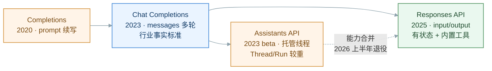
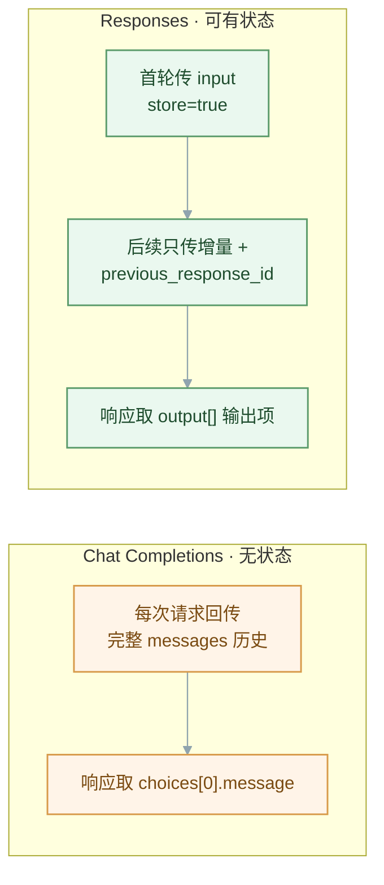
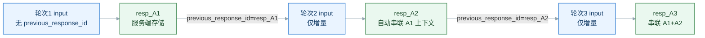
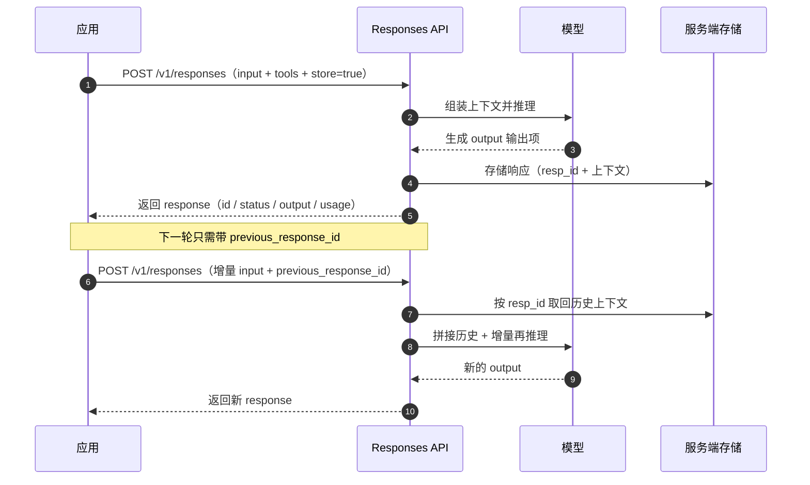
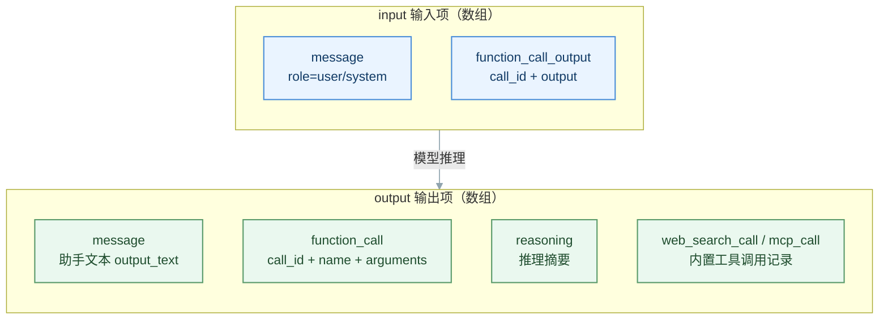
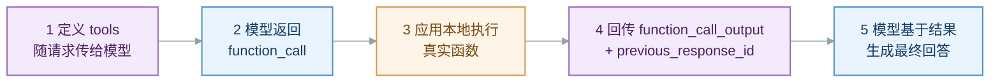
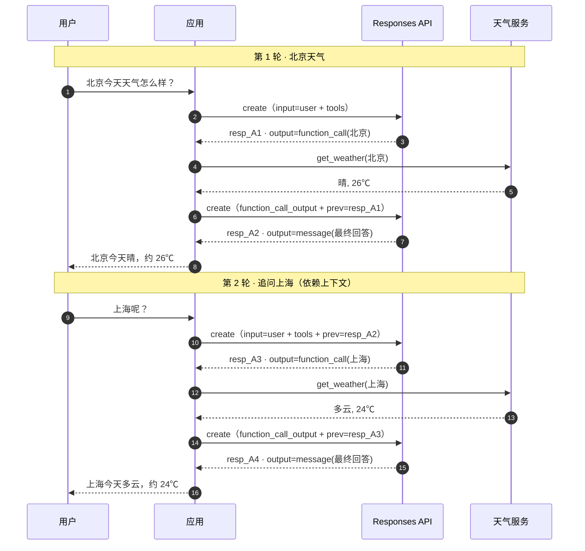

> 📌 **一句话概括：**Responses API 是 OpenAI 于 2025 年 3 月推出的**新一代核心 API 原语**，它把 Chat Completions 的简洁性与 Assistants 的工具使用、状态管理能力融为一体。最大变化是：请求入参从 `messages` 换成 **`input`**、响应从 `choices` 换成**语义化的 `output` 输出项数组**，并支持用 **`previous_response_id`** 让服务端托管多轮上下文——被官方定位为「面向 Agent 时代」的默认接口。

**阅读导航：**本文依次讲解 Responses API 的概念、与 Chat Completions API 的对比、有状态原理与请求生命周期、参数定义（以 GPT 为例），最后用一个天气查询 Demo 展示多轮会话中真实的入参与出参。

---

# 一、什么是 Responses API

Responses API 是 OpenAI 用于与大模型交互的最新接口，端点为 `POST /v1/responses`。它保留了「一次请求生成一次回答」的直觉，同时内置了**工具调用、服务端状态管理、内置工具（Web 搜索 / 文件搜索 / Computer Use / MCP）**等能力，是为**推理模型**与**Agent 工作流**量身设计的原语。

## 1.1 API 演进：从 Completions 到 Responses



> 💡 **关键定位：**Chat Completions **不会被淘汰**，OpenAI 承诺无限期支持；而更早的 Assistants API 将在 2026 年上半年宣布弃用，其能力由 Responses API 承接。对**新项目**，官方建议直接使用 Responses API。

## 1.2 核心特性一览

| 特性 | 说明 |
|-|-|
| **有状态会话** | `store=true` 时响应存于服务端，下一轮用 `previous_response_id` 续接，无需回传完整历史 |
| **语义化输出** | 响应是结构化的 `output` 输出项数组（message / function_call / reasoning …），事件驱动、类型安全 |
| **内置工具** | 原生集成 Web 搜索、文件搜索、Computer Use、图像生成、代码解释器、远程 MCP |
| **多模态一等公民** | 文本、图像、音频、函数调用从设计之初就是同级输入/输出，而非事后叠加 |
| **推理模型友好** | 推理项（reasoning item）可跨轮复用，减少重复思考，提升效果与性价比 |
| **灵活输入** | `input` 可为一句字符串，也可为消息 / 工具结果等输入项数组 |

## 1.3 一个最简调用

```json
// 请求
{
  "model": "gpt-4.1",
  "input": "用一句话解释什么是 API"
}

// 响应（节选）
{
  "id": "resp_68a1...",
  "object": "response",
  "status": "completed",
  "output": [
    {
      "type": "message",
      "role": "assistant",
      "content": [
        { "type": "output_text", "text": "API 是软件之间约定好的调用接口。" }
      ]
    }
  ],
  "usage": { "input_tokens": 12, "output_tokens": 14, "total_tokens": 26 }
}
```

---

# 二、Responses API 与 Chat Completions API 的对比

二者都能完成文本生成与工具调用，但**请求/响应形态、状态管理方式存在系统性差异。理解差异的关键在于两点：输入输出字段的变化**与**上下文由谁维护**。

## 2.1 设计理念差异



## 2.2 逐项对比

| 对比维度 | Chat Completions API | Responses API |
|-|-|-|
| **端点** | `/v1/chat/completions` | `/v1/responses` |
| **状态管理** | 无状态，客户端自行维护完整 `messages` | 可有状态，服务端存储，用 `previous_response_id` 续接 |
| **输入字段** | `messages` 数组 | `input`（字符串 或 输入项数组） |
| **输出字段** | `choices[].message` | `output[]` 输出项数组 + 便捷字段 `output_text` |
| **系统提示** | `role: system/developer` 的消息 | `instructions` 参数，或 `input` 中的 message |
| **工具定义** | `tools[].function`**嵌套**结构 | `tools[]`**扁平**结构（`type`、`name` 同级） |
| **工具调用（出参）** | `message.tool_calls[]` | `output` 中 `type=function_call` 项 |
| **工具结果（入参）** | `role: tool` + `tool_call_id` | `input` 中 `type=function_call_output` + `call_id` |
| **内置工具** | 无，需自建 | Web 搜索 / 文件搜索 / Computer Use / MCP / 图像生成 |
| **流式** | `delta` 增量拼接，需手动跟踪状态 | 语义事件（`response.output_text.delta` 等），事件驱动 |
| **多模态** | 逐步叠加 | 原生一等公民 |
| **推理模型** | 推理过程不跨轮复用 | reasoning item 可跨轮传递，效果与性价比更优 |
| **定位** | 行业标准，长期支持 | 新一代 agentic 原语，官方推荐新项目使用 |

> 💡 **最容易踩的坑：**两套 `tools` 格式**不能混用**。把 Chat Completions 的嵌套 `function: {…}` 定义直接发给 `/v1/responses`（或反过来）是 SDK 报「参数无效」最常见的原因。

## 2.3 工具定义格式差异（关键）

```json
// Chat Completions —— 嵌套在 function 下
{
  "type": "function",
  "function": {
    "name": "get_weather",
    "description": "查询指定城市的当前天气",
    "parameters": { "type": "object", "properties": { "city": { "type": "string" } }, "required": ["city"] }
  }
}

// Responses —— 扁平，type 与 name 同级
{
  "type": "function",
  "name": "get_weather",
  "description": "查询指定城市的当前天气",
  "parameters": { "type": "object", "properties": { "city": { "type": "string" } }, "required": ["city"] }
}
```

## 2.4 基础调用代码对比

| 步骤 | Chat Completions | Responses |
|-|-|-|
| 发起请求 | `client.chat.completions.create(model, messages=[…])` | `client.responses.create(model, input="…")` |
| 取文本 | `resp.choices[0].message.content` | `resp.output_text` |
| 续接多轮 | 手动把上一轮 `message` push 回 `messages` | 传 `previous_response_id=resp.id` |

---

# 三、Responses API 的原理

Responses API 的核心机制围绕**「有状态的响应链」**与**「结构化输入输出项」**展开。理解这两点，就理解了它与 Chat Completions 的本质区别。

## 3.1 有状态原理：previous_response_id 响应链

服务端为每次响应分配唯一 `id`（如 `resp_A1`），并在 `store=true` 时保存该响应及其上下文。下一轮请求只需带上 `previous_response_id`，服务端便自动**拼接完整历史**，客户端无需回传全部消息。



> 💡 \*\*两种模式可自由选择：\*\*① **有状态**——`store=true` + `previous_response_id`，服务端托管上下文，请求体最小；② **无状态**——`store=false`，把历史输出项显式放进 `input` 数组自行携带（适用于零数据留存 ZDR 场景）。工具调用轮次尤其建议携带上一轮的推理/调用项以保证效果。

## 3.2 请求生命周期（时序图）



## 3.3 输入与输出的结构化「项（Item）」

Responses API 把对话统一抽象为**输入项**与**输出项**。无论用户消息、模型回复、函数调用还是函数结果，都是带 `type` 的结构化项，可拼接成数组。



| 项类型（type） | 出现位置 | 关键字段 | 含义 |
|-|-|-|-|
| `message` | 输入 / 输出 | `role`、`content[]` | 一条消息；输出的 content 内为 `output_text` / `refusal` |
| `function_call` | 输出 | `call_id`、`name`、`arguments` | 模型请求调用某函数（`arguments` 为 JSON 字符串） |
| `function_call_output` | 输入 | `call_id`、`output` | 应用回传的函数执行结果，`call_id` 与调用配对 |
| `reasoning` | 输出 | `summary` | 推理模型的思考摘要，可跨轮携带 |
| `web_search_call` / `file_search_call` / `mcp_call` | 输出 | 各工具专属 | 内置 / 远程工具的调用记录 |

## 3.4 Function Calling 编排闭环



---

# 四、Responses API 的参数定义（以 GPT 为例）

以下字段基于 GPT 系列（gpt-4.1 / gpt-5 / o 系列）在 `POST /v1/responses` 上的定义。

## 4.1 请求参数（Request）

| 参数 | 类型 | 必填 | 说明 |
|-|-|-|-|
| `model` | string | 是 | 模型 ID，如 `gpt-4.1`、`gpt-5`、`o4-mini` |
| `input` | string \| array | 通常必填 | 一句文本，或消息 / `function_call_output` 等输入项数组 |
| `instructions` | string | 否 | 系统 / 开发者级指令；**不随**`previous_response_id` 继承，每轮需重传 |
| `tools` | array | 否 | 可用工具数组（`function` 及内置工具 `web_search` / `file_search` / `mcp` 等） |
| `tool_choice` | string \| object | 否 | `auto`（默认）/ `none` / `required` / 指定某工具 |
| `previous_response_id` | string | 否 | 上一次响应的 `id`，用于服务端串联多轮上下文 |
| `store` | boolean | 否 | 默认 `true`，是否在服务端存储该响应以供后续引用 |
| `stream` | boolean | 否 | 是否以语义事件流式返回 |
| `max_output_tokens` | integer | 否 | 输出（含推理）token 上限 |
| `temperature` / `top_p` | number | 否 | 采样参数 |
| `text` | object | 否 | 输出文本格式配置，如 Structured Outputs 的 `format.json_schema` |
| `reasoning` | object | 否 | 推理模型专用：`effort`（low/medium/high）、`summary` |
| `parallel_tool_calls` | boolean | 否 | 是否允许一次返回多个工具调用 |
| `include` | array | 否 | 额外返回内容，如 `reasoning.encrypted_content` |
| `metadata` | object | 否 | 自定义键值对，随响应回带 |
| `background` | boolean | 否 | 是否后台异步运行长任务 |

## 4.2 tools 中 function 的定义

| 字段 | 类型 | 必填 | 说明 |
|-|-|-|-|
| `type` | string | 是 | 固定为 `"function"`（内置工具则为 `web_search` 等） |
| `name` | string | 是 | 函数唯一名称，模型据此选择 |
| `description` | string | 否 | 函数用途描述，影响模型是否调用 |
| `parameters` | object | 是 | 入参的 JSON Schema |
| `strict` | boolean | 否 | 开启严格模式，保证 `arguments` 严格符合 Schema |

## 4.3 响应对象字段（Response）

| 字段 | 类型 | 说明 |
|-|-|-|
| `id` | string | 响应唯一 ID，形如 `resp_xxx`，用作下一轮 `previous_response_id` |
| `object` | string | 固定为 `"response"` |
| `created_at` | number | 创建时间戳 |
| `status` | string | `completed` / `in_progress` / `failed` / `incomplete` |
| `model` | string | 实际使用的模型（含日期版本） |
| `output` | array | **核心**：输出项数组（message / function_call / reasoning …） |
| `output_text` | string | SDK 便捷字段，聚合所有文本输出 |
| `usage` | object | `input_tokens` / `output_tokens` / `total_tokens` |
| `previous_response_id` | string | 关联的上一响应 ID（若有） |
| `error` / `incomplete_details` | object | 失败或截断的原因 |
| `metadata` | object | 回带的自定义键值 |

## 4.4 output 常见输出项类型

| type | 关键字段 | 含义 |
|-|-|-|
| `message` | `role`、`content[]`（`output_text` / `refusal`） | 助手文本回复 |
| `function_call` | `call_id`、`name`、`arguments` | 函数调用意图 |
| `reasoning` | `summary` | 推理摘要（推理模型） |
| `web_search_call` | `status`、`action` | 内置 Web 搜索调用记录 |
| `file_search_call` | `queries`、`results` | 内置文件搜索调用记录 |
| `mcp_call` | `server_label`、`name`、`arguments` | 远程 MCP 工具调用 |

---

# 五、真实调用参数案例：天气查询多轮会话

下面用一个最小 Demo 走完真实链路：应用提供一个 `get_weather` 函数，用户先问「北京天气」，再追问「上海呢？」。重点观察**每一步真实的入参与出参**，以及 `previous_response_id` 如何让第二轮无需重复上下文。

## 5.1 场景与整体时序



## 5.2 第 1 轮 · 请求 A1（用户提问）

```json
// ① 入参：POST /v1/responses
{
  "model": "gpt-4.1",
  "input": [
    { "role": "user", "content": "北京今天天气怎么样？" }
  ],
  "tools": [
    {
      "type": "function",
      "name": "get_weather",
      "description": "查询指定城市的当前天气",
      "parameters": {
        "type": "object",
        "properties": {
          "city": { "type": "string", "description": "城市名，如：北京" }
        },
        "required": ["city"],
        "additionalProperties": false
      }
    }
  ],
  "store": true
}
```

```json
// ② 出参：模型决定调用工具，output 中出现 function_call
{
  "id": "resp_A1",
  "object": "response",
  "status": "completed",
  "model": "gpt-4.1-2025-04-14",
  "output": [
    {
      "type": "function_call",
      "id": "fc_01",
      "call_id": "call_bj_001",
      "name": "get_weather",
      "arguments": "{\"city\":\"北京\"}"
    }
  ],
  "usage": { "input_tokens": 74, "output_tokens": 18, "total_tokens": 92 }
}
```

> 💡 **注意：**此轮 `output` 里没有文本 `message`，只有一个 `function_call`——模型在「表达它想调用哪个函数、传什么参数」。真正的天气查询发生在**应用本地**，API 不会替你执行函数。

## 5.3 第 1 轮 · 请求 A2（回传函数结果 → 最终回答）

应用本地执行 `get_weather("北京")` 得到 `{"temp":"26℃","condition":"晴"}`，然后把结果作为 `function_call_output` 回传，并用 `previous_response_id` 续接。

```json
// ① 入参：只需增量（函数结果），历史由服务端托管
{
  "model": "gpt-4.1",
  "previous_response_id": "resp_A1",
  "input": [
    {
      "type": "function_call_output",
      "call_id": "call_bj_001",
      "output": "{\"city\":\"北京\",\"temp\":\"26℃\",\"condition\":\"晴\"}"
    }
  ],
  "store": true
}
```

```json
// ② 出参：模型基于函数结果生成自然语言回答
{
  "id": "resp_A2",
  "object": "response",
  "status": "completed",
  "previous_response_id": "resp_A1",
  "output": [
    {
      "type": "message",
      "id": "msg_01",
      "role": "assistant",
      "content": [
        { "type": "output_text", "text": "北京今天天气晴，气温约 26℃，适合外出活动。" }
      ]
    }
  ],
  "usage": { "input_tokens": 96, "output_tokens": 21, "total_tokens": 117 }
}
```

## 5.4 第 2 轮 · 请求 A3（追问「上海呢？」）

用户只说了「上海呢？」，并未重复「天气」。因为带了 `previous_response_id=resp_A2`，服务端已托管前文，模型**自动理解语境**仍是天气查询，直接对上海发起 `function_call`。

```json
// ① 入参：用户追问 + 同一套 tools + 续接上一响应
{
  "model": "gpt-4.1",
  "previous_response_id": "resp_A2",
  "input": [
    { "role": "user", "content": "上海呢？" }
  ],
  "tools": [
    {
      "type": "function",
      "name": "get_weather",
      "description": "查询指定城市的当前天气",
      "parameters": {
        "type": "object",
        "properties": { "city": { "type": "string", "description": "城市名，如：北京" } },
        "required": ["city"],
        "additionalProperties": false
      }
    }
  ],
  "store": true
}
```

```json
// ② 出参：模型正确推断出要查「上海」
{
  "id": "resp_A3",
  "object": "response",
  "status": "completed",
  "previous_response_id": "resp_A2",
  "output": [
    {
      "type": "function_call",
      "id": "fc_02",
      "call_id": "call_sh_002",
      "name": "get_weather",
      "arguments": "{\"city\":\"上海\"}"
    }
  ],
  "usage": { "input_tokens": 88, "output_tokens": 17, "total_tokens": 105 }
}
```

> 💡 **这正是 Responses API 的价值：**第 2 轮请求体里**没有**第 1 轮的任何历史消息，仅靠 `previous_response_id` 就完成了上下文延续。换成 Chat Completions，你必须把前 4 条消息（user / assistant tool_calls / tool / assistant）全部重新塞进 `messages` 才能让模型理解「上海」指的是天气。

## 5.5 第 2 轮 · 请求 A4（回传结果 → 最终回答）

```json
// ① 入参
{
  "model": "gpt-4.1",
  "previous_response_id": "resp_A3",
  "input": [
    {
      "type": "function_call_output",
      "call_id": "call_sh_002",
      "output": "{\"city\":\"上海\",\"temp\":\"24℃\",\"condition\":\"多云\"}"
    }
  ],
  "store": true
}
```

```json
// ② 出参
{
  "id": "resp_A4",
  "object": "response",
  "status": "completed",
  "previous_response_id": "resp_A3",
  "output": [
    {
      "type": "message",
      "role": "assistant",
      "content": [
        { "type": "output_text", "text": "上海今天多云，气温约 24℃，比北京略凉，出门可备一件薄外套。" }
      ]
    }
  ],
  "usage": { "input_tokens": 118, "output_tokens": 27, "total_tokens": 145 }
}
```

## 5.6 全链路小结

| 轮次 | 请求关键入参 | 响应关键出参 | 作用 |
|-|-|-|-|
| A1 | `input`=用户提问 + `tools` | `function_call`(北京) | 模型表达调用意图 |
| A2 | `function_call_output` + `previous_response_id`=A1 | `message` 最终回答 | 回填结果、生成回答 |
| A3 | `input`=「上海呢？」+ `previous_response_id`=A2 | `function_call`(上海) | 靠上下文推断语境 |
| A4 | `function_call_output` + `previous_response_id`=A3 | `message` 最终回答 | 回填结果、生成回答 |

> ✅ **小结：**Responses API 用 **`input` / `output` 结构化项** 取代 `messages` / `choices`，用 **`previous_response_id` + `store`** 把多轮上下文托管到服务端，用 **扁平化 `tools` + `function_call` / `function_call_output`** 完成工具调用闭环。它让多轮、带工具、带推理的 Agent 工作流写起来更简洁、更省 token、也更类型安全——这正是 OpenAI 把它作为「面向未来」默认接口的原因。
